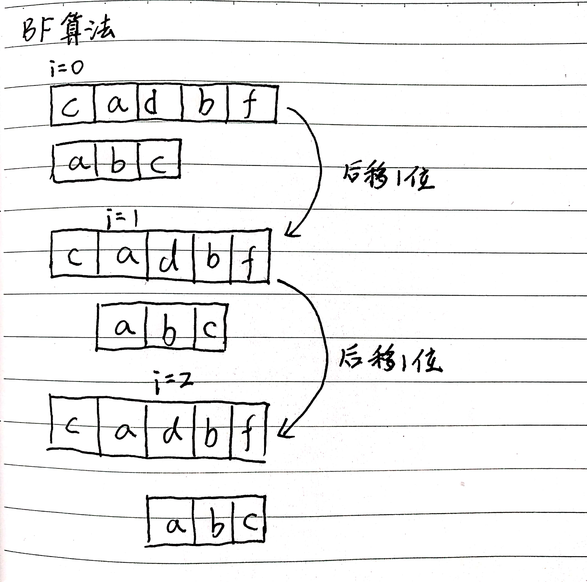

# 字符串匹配算法(I)

## 1. BF算法介绍

BF算法中的BF是Brute Force的缩写，也叫朴素匹配算法。我们把字符串分为主串和模式串。

在字符串A中查找字符串B，那么A就是主串，B就是模式串。主串长度记为n，模式串长度记为m，m>n。


## 2. 代码实现

```java
/**
 * search the module in the primary, if not exists return -1,else return the index
 * @param primary
 * @param module
 * @return index of primary that equals with module
 */
public static int bfMatch(String primary, String module) {
    int n = primary.length();
    int m = module.length();
    if (n < m) return -1;
    for (int i = 0; i < n - m + 1; i++) {
        if (module.equals(primary.substring(i, i + m))) {
            return i;
        }
    }
    return -1;
}
```

## 3. 时间复杂度分析

每次匹配不成功，都要向后移动一位，由于模式串长度为m，最坏时间复杂度为O(n*m)
