# 字符串匹配算法III

## 1. Boyer-Moore算法介绍

模式串和主串的匹配过程，可以看成模式串在主串中不停往后移动。当遇到不匹配的字符时，BF算法和RK算法都是往后移动一位，然后从模式串的第一个字符开始重新匹配。BM算法就是寻找规律，往后能多移动几位。

## 2. BM算法原理分析

BM算法包含2部分，分别为坏字符(bad character rule) 和好后缀规则(good suffix shift)。

### 2.1 坏字符规则

BM算法匹配方式为倒着匹配，见下图：

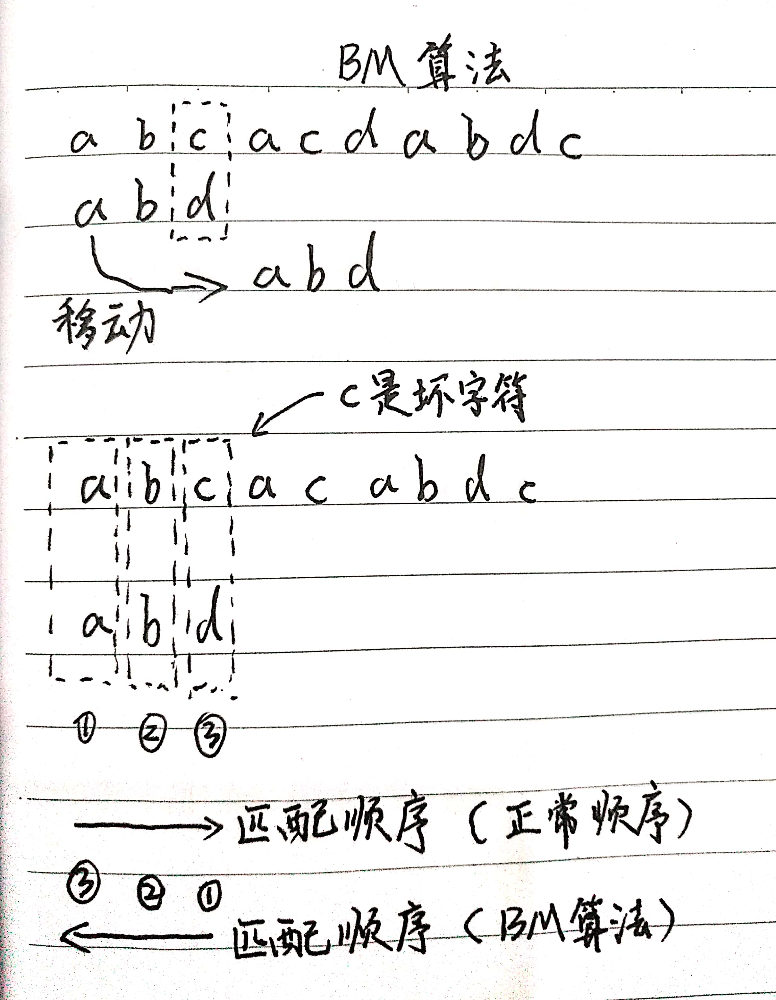

我们拿坏字符c在模式串中查找，发现模式串中不存在这个字符，也就是说，坏字符与模式串中的所有字符都不匹配。这样我们直接滑动3位，将模式串滑动到c后面的位置，再从模式串的末尾字符开始比较
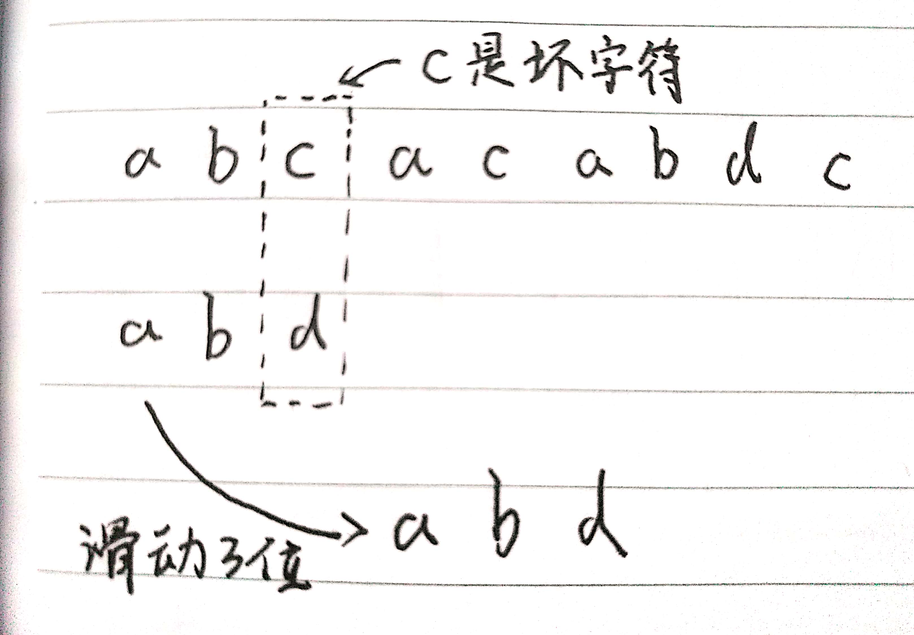

当发生不匹配的时候，我们把坏字符的下标记作si。如果坏字符在模式串中存在，我们把坏字符在模式串中的下标记作xi。如果不存在，xi记作-1。那么模式串往后移动的位数等于si-xi。(这里都说的时模式串的下标)
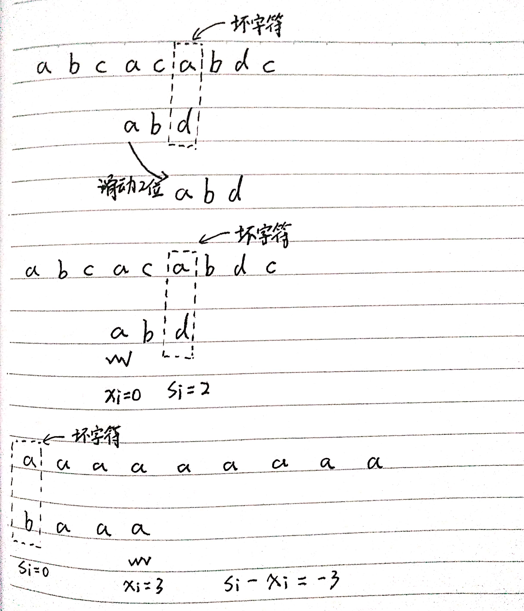

如果坏字符在模式串中多次出现，计算xi的值选择最右的，这样就不会滑动过多。

利用坏字符规则，BM算法在最后情况下的时间复杂度非常低，是O(n/m)。比如主串是aaabaaabaaabaaab，模式串是aaaa。每次对比都会滑动四位。

不过，单纯使用坏字符规则还是不够的。因为根据si-xi的值计算移动位数，有时候是负数。比如主串是aaaaaaaaaaaaaaaaaaa，模式串是baaa。这样就会倒退。所以，还要用到“好后缀规则”。

### 2.2 好后缀规则

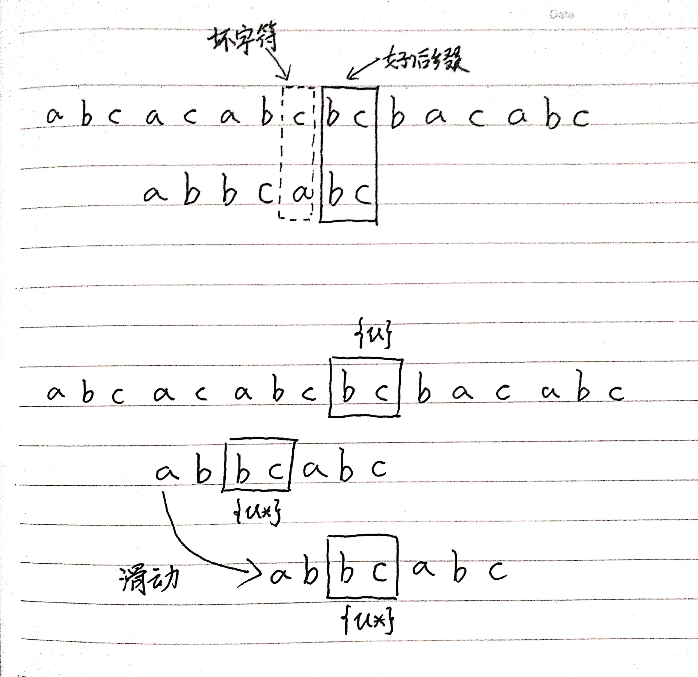

如果模式串中找不到另一个等于{u}的子串，直接将模式串滑动到主串中{u}的后面，因为之前的任何一次滑动都没有匹配主串中{u}的情况。
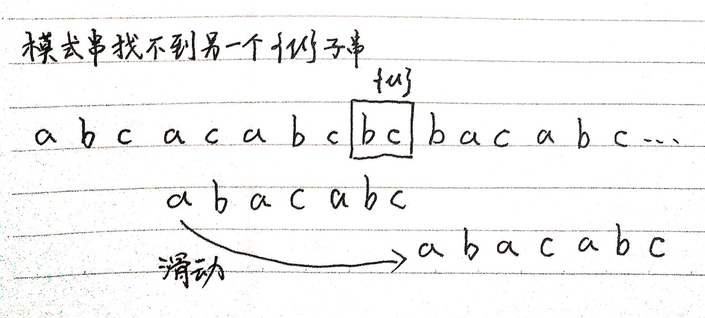

不过，当模式串中不存在等于{u}子串时，直接将模式串滑动到主串中{u}的后面存在滑动过头的情况：
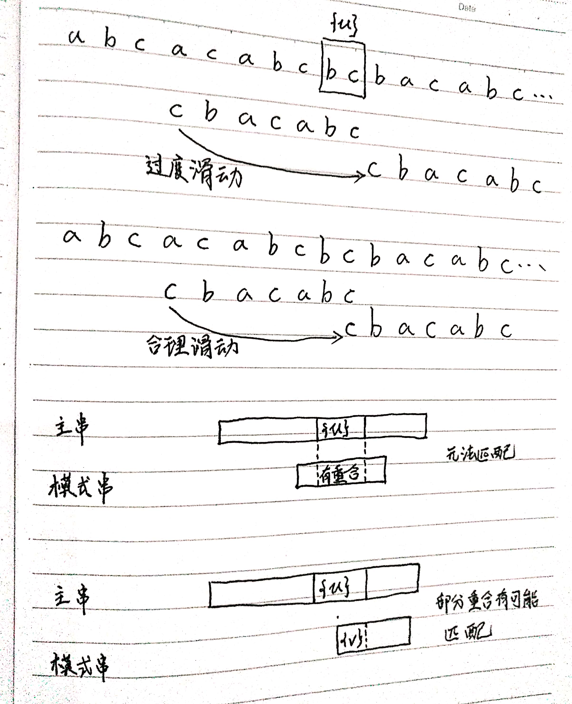

所谓某个字符串s的后缀子串，就是最后一个字符跟s对齐的子串，比如abc的后缀子串就包括c，bc。所谓前缀子串，就是起始字符跟s对齐的子串，比如abc的前缀子串有a，ab。我们从好后缀的后缀子串中，找一个最长的并且跟模式串的前缀子串匹配的，假设是{v}，然后将模式串滑动到如图所示的位置。
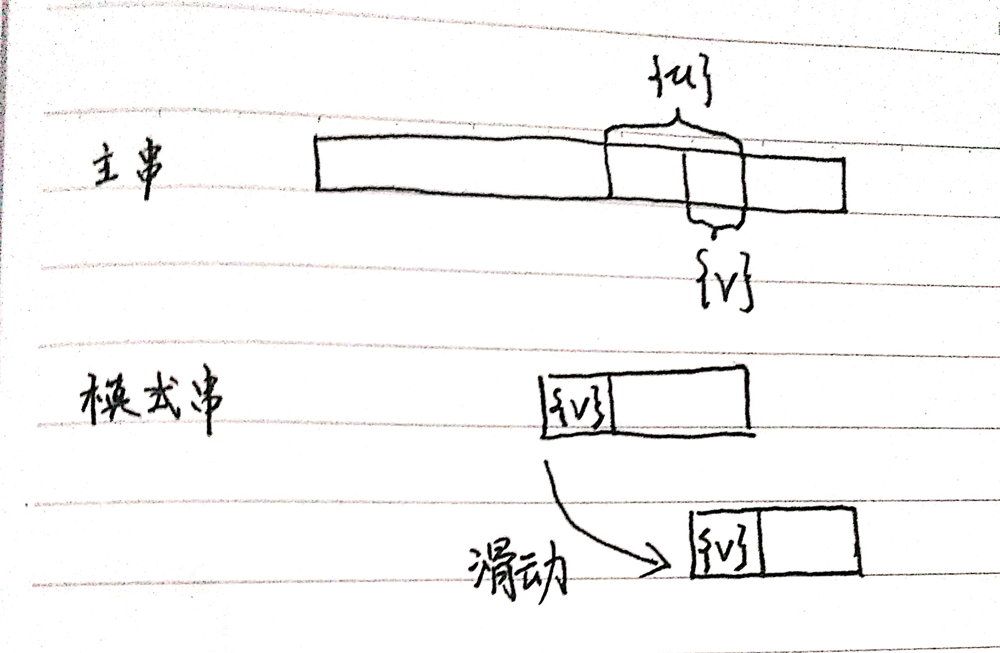

当模式串和主串中某个字符不匹配的时候，如何选择是好后缀还是坏字符规则？其实可以分别计算好后缀和坏字符往后滑动的位数，取最大数往后移动就可以避免往后滑动位数是负数的情况。

## 3. 算法代码实现

我们拿坏字符在模式串中顺序遍历查找，这样就会比较低效，影响这个算法的性能。通过增加一个散列表来快速找到坏字符在模式串中的下标。

假设字符串的字符集不是很大，每个字符长度是1字节，我们用大小为256的数组，来记录每个字符在模式串中出现的位置。数组的下标对应的ASCII码值，数组中存储这个字符在模式串中出现的位置。

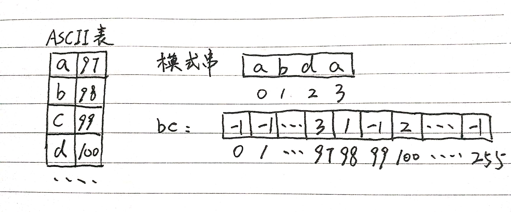

```java
// b: module string, m: length of module string, bc: hash table
private static final int SIZE = 256;
private void generateBC(char[] b, int m, int[] bc) {
    for (int i = 0; i < SIZE; i++) {
        bc[i] = -1;
    }
    for (int i = 0; i < m; i++) {
        int ascii = (int)b[i];
        bc[ascii] = i;
    }
}
```

掌握了坏字符规则之后，我们先把BM算法代码大框架写好，先不考虑好后缀规则，仅用坏字符规则，并且不考虑si-xi是负数的情况。

```java
public int bm(char[] a, int n, char[] b, int m) {
    int[] bc = new int[SIZE];
    generateBC(b, m, bc);   // 构建坏字符哈希表
    int i = 0;  // i表示主串与模式串对其的第一个字符
    while (i <= n - m) {
        int j;
        for (j = m - 1;j >= 0; j--) {
            if (a[i + j] != b[j]) break;    // 坏字符对应模式串中的时下标j
        }
        if (j < 0) {
            return i;   // 匹配成功，返回主串与模式串第一个匹配的字符的位置
        }
        // 这里等同于将模式串往后滑动j-bc[(int)a[i+j]]位
        i = i + (j - bc[(int)a[i + j]]);
    }
    return -1;
}
```

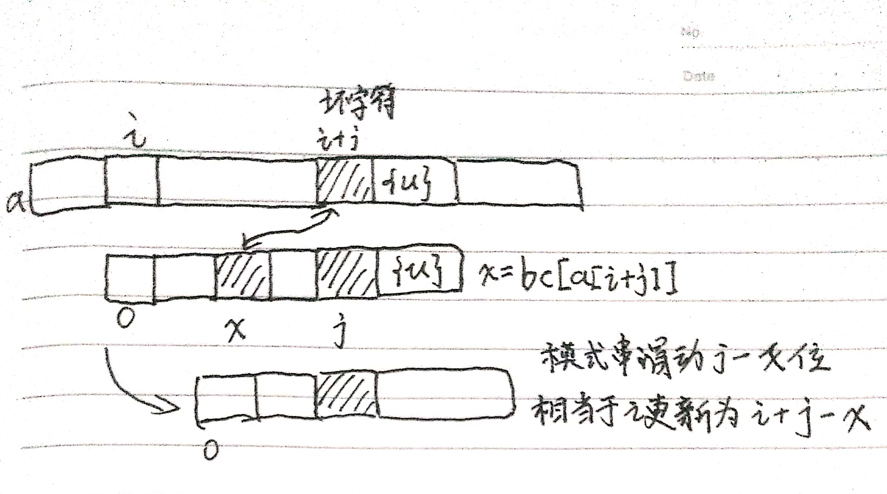

如何表示模式串中不通的后缀子串呢？因为后缀子串的最后一个字符的位置是固定的，下标为m-1，我们只需要记录长度就可以了。通过长度就可以确定一个唯一的后缀子串。

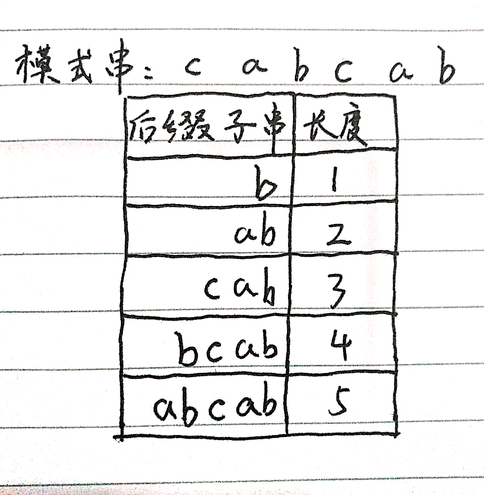

我们引入最关键的变量suffix数组。suffix数组的下标k，表示后缀子串的长度，下标对应的数组存储的是，在模式串中跟好后缀{u}匹配的子串{u*}的起始下标值。再增加一个boolean类型的prefix数组，来记录模式串的后缀子串是否能匹配模式串的前缀子串。

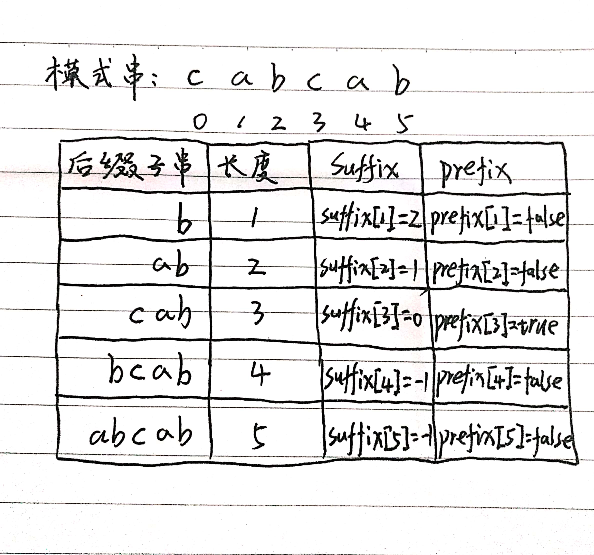

我们拿下标从0到i的子串(i可以是0到m-2)与整个模式串，求公共后缀子串。如果公共后缀子串的长度是k，那我们就记录suffix[k]=j(j表示公共后缀子串的起始下标)。如果j等于0，也就是说，公共后缀子串也是模式串的前缀子串，我们就记录prefix[k]=true。

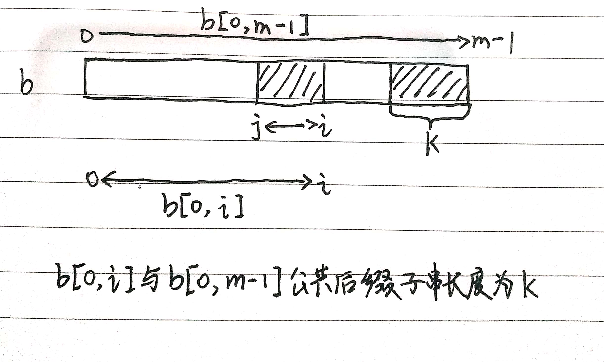

```java
// b 表示模式串，m表示长度，suffix，prefix数组事先申请好了
private void generateGS(char[] b, int m, int[] suffix, boolean[] prefix) {
    for (int i = 0; i < m; i++) {
        suffix[i] = -1;
        prefix[i] = false;
    }
    for (int i = 0; i < m - 1; i++) {
        int j = i;
        int k = 0;  // 公共后缀子串长度
        while (j >= 0 && b[j] == b[m - 1 - k]) {
            --j;
            ++k;
            suffix[k] = j + 1;  // j+1表示公共后缀子串在b[0, i]中的起始下标
        }
        if (j == -1) {
            prefix[j] = true;   // 如果公共后缀子串也是模式串的前缀子串
        }
    }
}
```

有了这两个数组之后，我们现在看，在模式串跟主串匹配的过程中，遇到不能匹配的字符时，如何根据好后缀规则，计算模式串往后滑动的位数？

假设好后缀的长度为k，我们先拿好后缀，在suffix数组中查找其匹配的子串。如果suffix[k]不等于-1(-1表示不存在匹配的子串)，那我们就将模式串往后移动j-suffix[k]+1位(j表示坏字符对应的模式串中的字符下标)。如果suffix[k]等于-1，表示模式串中不存在另一个跟好后缀匹配的子串片段。可以用下面这条规则处理：

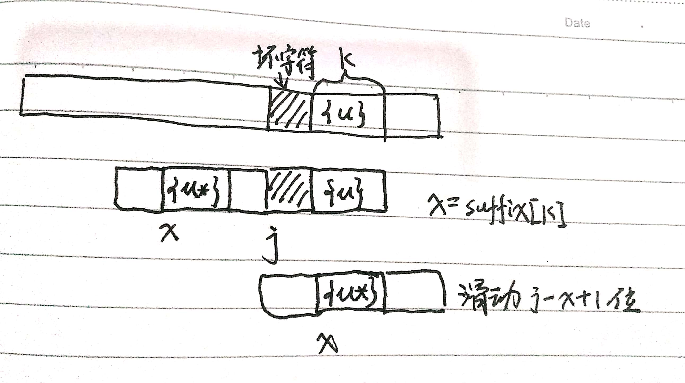

好后缀的后缀子串b[r, m-1](其中，r取值从j+2到m-1)的长度k=m-r，如果prefix[k]等于true，表示长度为k的后缀子串，有可匹配的前缀子串，这样我们把模式串后移r位。

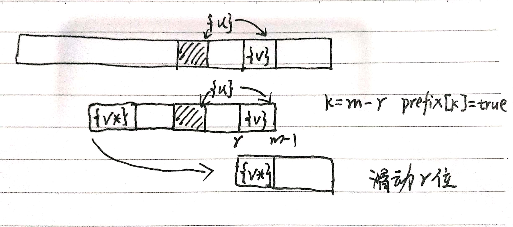

如果两条规则都没有找到可以匹配的好后缀及其后缀子串的子串，我们将整个模式串后移m位。

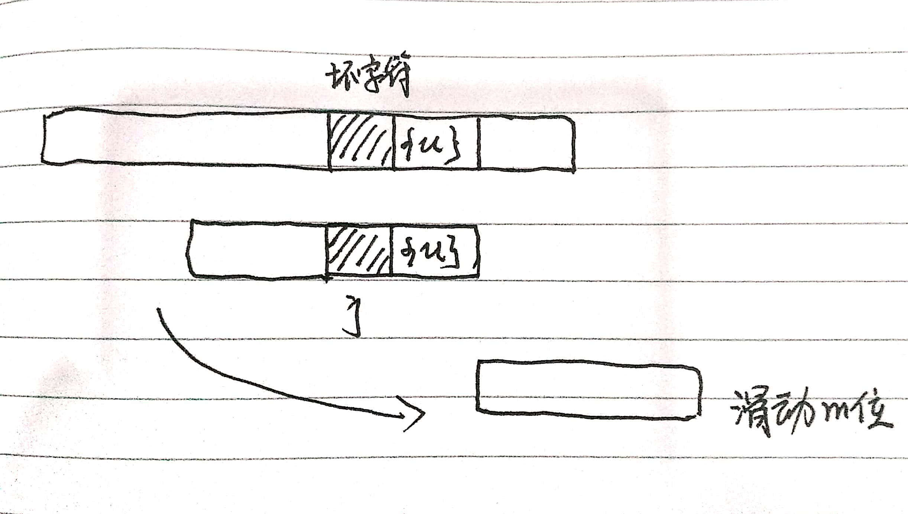

完整代码实现如下：

```java
// a, b 表示主串和模式串；n, m表示主串和模式串的长度
public int bm(char[] a, int n, char[] b, int m) {
    int[] bc = new int[SIZE];   // 记录模式串中每个字符最后出现的位置
    generateBC(b, m, bc);       // 构建坏字符哈希表
    int[] suffix = new int[m];
    boolean[] prefix = new boolean[m];
    generateGS(b, m, suffix, prefix);
    int i = 0;  // j表示主串与模式串匹配的第一个字符
    while (i <= n - m) {
        int j;
        for (int j = m - 1; j >= 0; j--) {  // 模式串从后往前匹配
            if (a[i + j] != b[j]) break;
        }
        if (j < 0) {
            return i;   // 匹配成功，返回主串与模式串第一个匹配的字符的位置
        }
        int x = j - bc[(int)a[i + j]];
        int y = 0;
        if (j < m - 1) {    // 如果有好后缀的话
            y = moveByGS(j, m, suffix, prefix);
        }
        i = i + Math.max(x, y);
    }
    return -1;
}

// j表示坏字符对应的模式串中的字符下标，m表示模式串长度
private int moveByGS(int j, int m, int[] suffix, boolean[] prefix) {
    int k = m - 1 - j;  // 好后缀长度
    if (suffix[k] != -1) {
        return j - suffix[k] + 1;
    }
    for (int r = j + 2; r <= m - 1; r++) {
        if (prefix[m - r] == true) {
            return r;
        }
    }
    return m;
}
```
