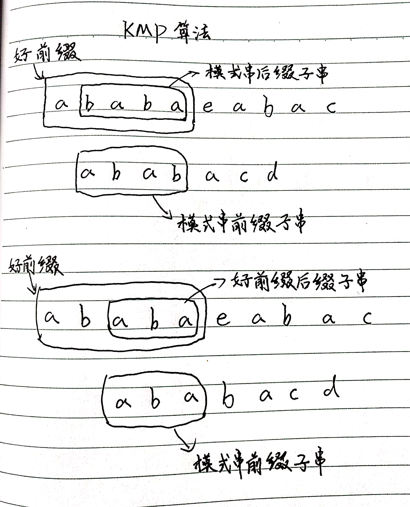
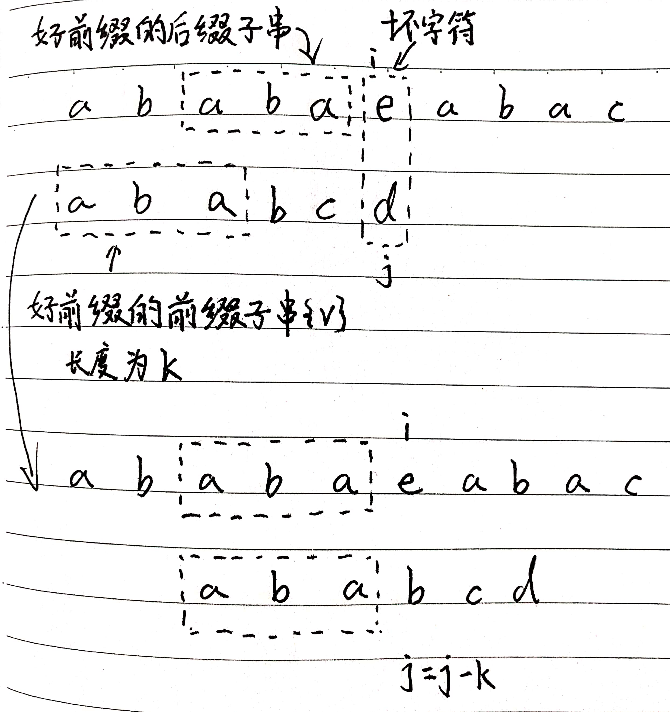
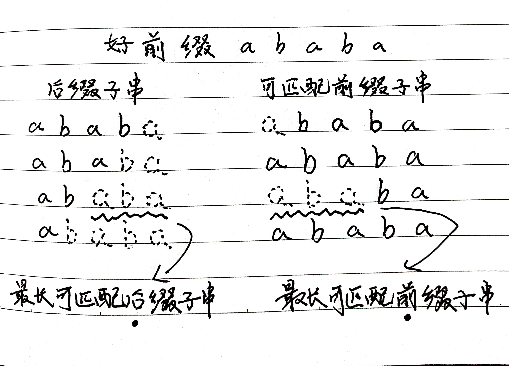
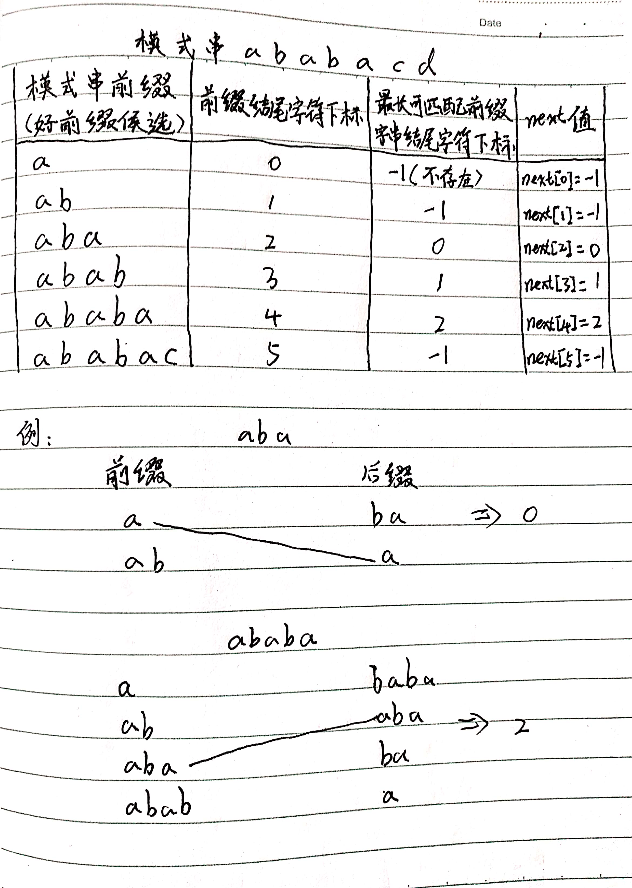
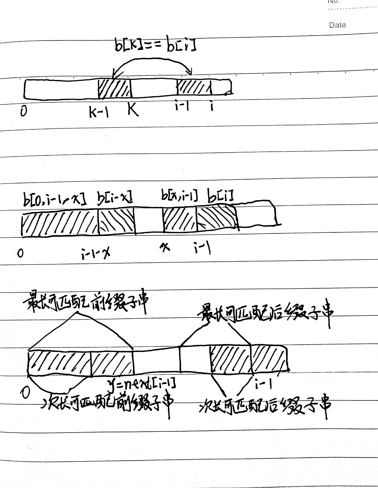

# 字符串匹配算法IV

## 1. KMP算法基本原理

KMP算法是根据三位作者(D.E.Knuth, J.H.Morris和V.R.Pratt)的名字来命名。全称为Knuth Morris Pratt算法，简称KMP算法。

KMP思想类似于BM算法，都是尽量把模式串往后多滑动几位。



我们只需要拿好前缀本身，在它的后缀子串中，查找最长的那个可以跟好前缀的前缀子串匹配的。假设最长的可匹配的那部分前缀子串是{v}，长度是k。我们把模式串一次往后滑动j-k位，相当于，每次遇到坏字符的时候，我们就把j更新为k，i不变，然后继续比较。



为了表述方便，我把前缀的所有后缀子串中，最长的可匹配前缀子串的那个后缀子串，叫做**最长可匹配后缀子串**；对应的前缀子串，叫做**最长可撇配前缀子串**。



类似BM算法中的bc，suffix，prefix数组，KMP算法也可以提前构建一个数组。用来存储模式串的每个前缀(这些前缀都有可能是好前缀)的最长匹配前缀子串的结尾符下标。我们把这个数组定义为**next数组**，也叫**失效函数**(failure function)。



有了next数组，可以很容易的实现KMP算法了。假设next数组已经计算好了，先给出框架代码。

```java
// a,b分别是主串和模式串;n,m分别是主串和模式创的长度
public static int kmp(int[] a, int n, int[] b, int m) {
    int[] next = getNext(b, m);
    int j = 0;
    for (int i = 0; i < n; i++) {
        while (j > 0 && a[i] != b[j]) { // 一直找到a[i]和b[j]
            j = next[j - 1] + 1;
        }
        if (a[i] == b[j]) {
            ++j;
        }
        if (j == m) {   // 找到匹配模式串
            return i - m + 1;
        }
    }
    return -1;
}
```

## 2. 失效函数计算方法

虽然可以使用上图中所有前缀子串和后缀子串拿出来比较来计算，但是这种方法效率太低。

这里使用类似于动态规划的方法。我们按照下标从小到大，依次计算next数组的值。当我们要计算next[i]的时候，前面的next[0],next[1],......,next[i - 1]应该都已经计算出来了。利用已经计算出来的next值，是否可以快速推到出next[i]的值呢？

如果next[i-1] = k-1，也就是说，子串b[0,k-1]是b[0,i-1]的最长可匹配前缀子串。如果子串b[0,k-1]的下一个字符b[k]，与b[0,i-1]的下一个字符b[i]匹配，那子串b[0,k]就是b[0,i]的最长可匹配前缀子串。所以next[i]等于k。但是如果b[0,k-1]的下一个字符b[k]跟b[0,i-1]的下一个字符b[i]不相等呢？



我们假设b[0,i]的最长可匹配后缀子串是b[r,i]。如果我们把最后一个字符去掉，那b[r,i-1]肯定是b[0,i-1]的可匹配后缀子串，但不一定是最长可匹配后缀子串。所以，既然b[0,i-1]最长可匹配后缀子串对应的模式串的下一个字符并不等于b[i]，那么我们就可以考察b[0,i-1]的次长可匹配后缀子串b[x,i-1]对应的可匹配前缀子串b[0,i-1-x]的下一个字符b[i-x]是否等于b[i]。如果等于，那b[x,i]就是b[0,i]的最长可匹配后缀子串。

可是如何求得b[0,i-1]的次长可匹配后缀子串呢？次长可匹配后缀子串肯定被包含在最长可匹配后缀子串中，而最长可匹配后缀子串又对应最长可匹配前缀子串b[0,y]。于是，查找b[0,i-1]的次长可匹配后缀子串，这个问题就变为，查找b[0,y]的最长可匹配前缀子串的问题了。

按照这个思路可以考察完所有的b[0,i-1]的可匹配后缀子串b[y,i-1]，直到找到一个可匹配的后缀子串，它对应的前缀子串的下一个字符等于b[i]，那这个b[y,i]就是b[0,i]的最长可匹配后缀子串。

```java
// b表示模式串,m表示模式串的长度
private static int[] getNexts(char[] b, int m) {
    int[] next = new int[m];
    next[0] = -1;
    int k = -1;
    for (int i = 1; i < m; i++) {
        while (k != -1 && b[k + 1] != b[i]) {
            k = next[k];
        }
        if (b[k + 1] == b[i]) {
            ++k;
        }
        next[i] = k;
    }
    return next;
}
```
