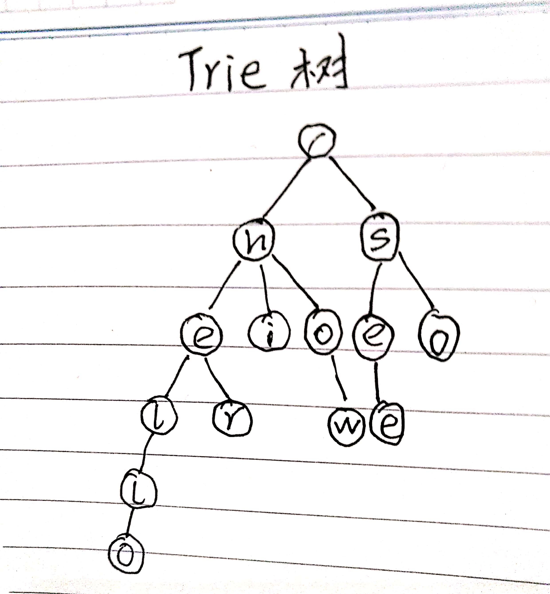
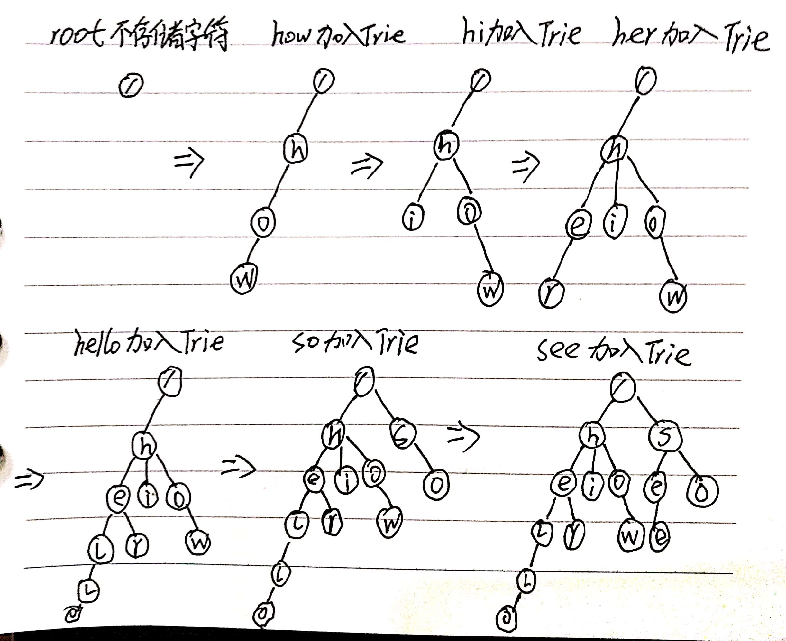
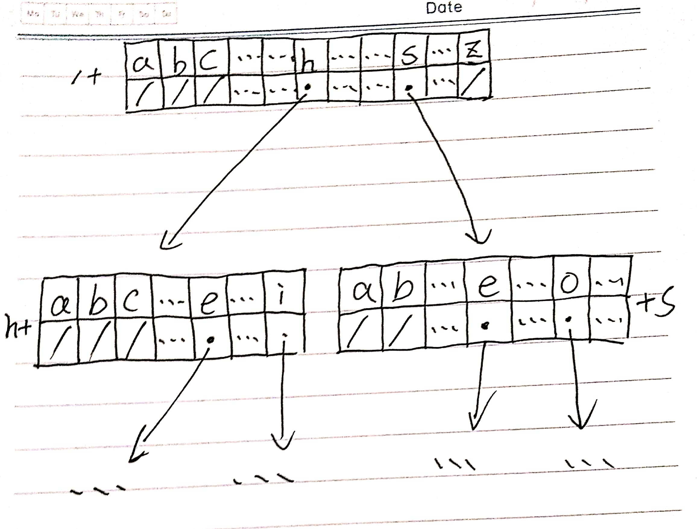
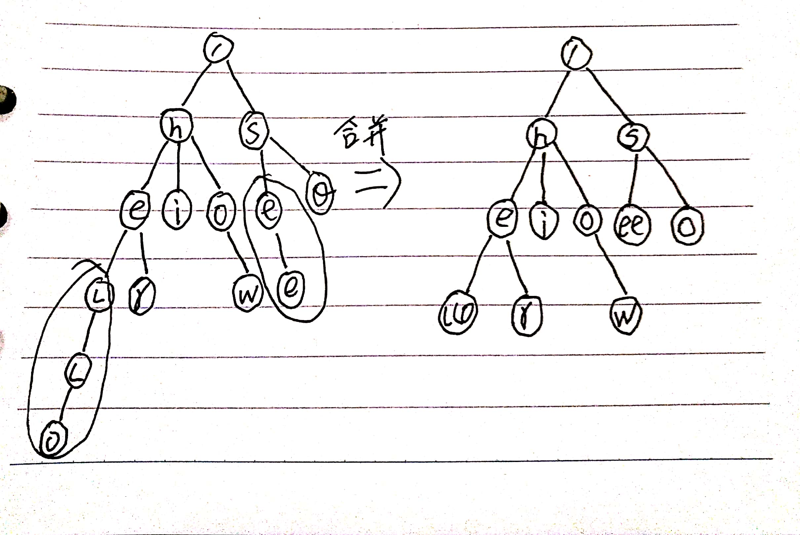

# 使用Trie树实现搜索引擎的搜索关键词提示功能

学习来源：[数据结构与算法之美-35](https://time.geekbang.org/column/article/72414)

我们在使用Google或者其他搜索引擎时，输入一个关键字就会自动提示各种关键词。完了可以直接在下拉框选择关键词来节省时间。这种实现的根本就是Trie树。

## 什么是Trie树

Trie树也叫字典树，是一种专门处理字符串匹配的数据结构。假如有6个字符串分别是：how, hi, her, hello, so, see。我们希望在里面多次查找某个字符串是否存在。使用Trie树的本质是**利用字符串之间的公共前缀，将重复的前缀合并到一起**。最后构造出来的结构如下：



其中，根节点不包含任何信息。每个节点表示一个字符串的字符，从根节点到红色节点的一条路径表示一个字符串。下面是Trie树构造的分解过程：



当在Trie树种查找一个字符串的时候，比如查找"her"，将要查找的字符串分割成字符h，e，r，然后从Trie树的根节点开始匹配。

## 如何实现一颗Trie树

Trie树是一个多叉树。二叉树中，一个节点的左右子节点是通过指针来存储，二叉树节点定义如下：

```java
class BinaryTreeNode {
    char data;
    BinaryTreeNode left;
    BinaryTreeNode right;
}
```

对于多叉树怎么存储一个节点的所有子节点的指针呢？第一种存储方式也是经典的存储方式，我们通过一个下标与字符一一映射的数组来存储节点的指针。示例图如下：



```java
class TrieNode {
    char data;
    TrieNode children[26];
}
```

当我们在Trie树种查找字符串的时候，我们就可以通过字符的ASCII码减去"a"的ASCII码，迅速找到匹配的子节点的指针。比如，d的ASCII码减去a的ASCII码就是3，那子节点d的指针就存储在数组中下标为3的位置中。

```java
public class Trie {
    private TrieNode root = new TrieNode('/');  // 存储无意义字符，根节点

    // 往Trie树种插入一个节点
    public void insert(char[] text) {
        TrieNode p = root;
        for (int i = 0; i < text.length; i++) {
            int index = text[i] - 'a';
            if (p.children[index] != null) {
                TrieNode newNode = new TrieNode(text[i]);
                p.children[index] = newNode;
            }
            p = p.children[index];
        }
        p.isEndingChar = true;
    }

    // 在Trie树中查找一个字符串
    public boolean find(char[] pattern) {
        TrieNode p = root;
        for (int i = 0; i < pattern.length; i++) {
            int index = pattern[i] - 'a';
            if (p.children[index] == null) {
                return false;
            }
            p = p.children[index];
        }
        if (!p.isEndingChar) {
            return false;   // 不完全匹配
        }
        return true;
    }

    public class TrieNode {
        public char data;
        public TrieNode[] children = new TrieNode[26];
        public boolean isEndingChar = false;
        public TrieNode(char data) {
            this.data = data;
        }
    }
}

```

为了解决内存消耗的问题，可以使用**缩点优化**，就是对只有一个子节点的节点，而且此节点不是一个串的结束节点，可以将此节点与子节点合并。


