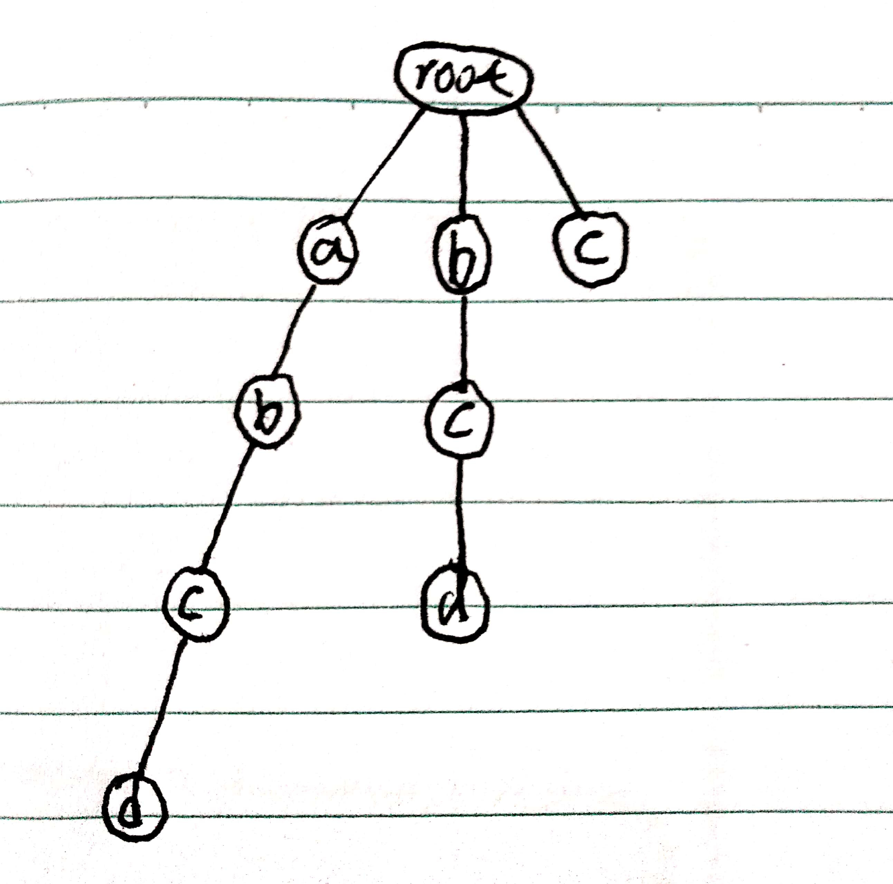
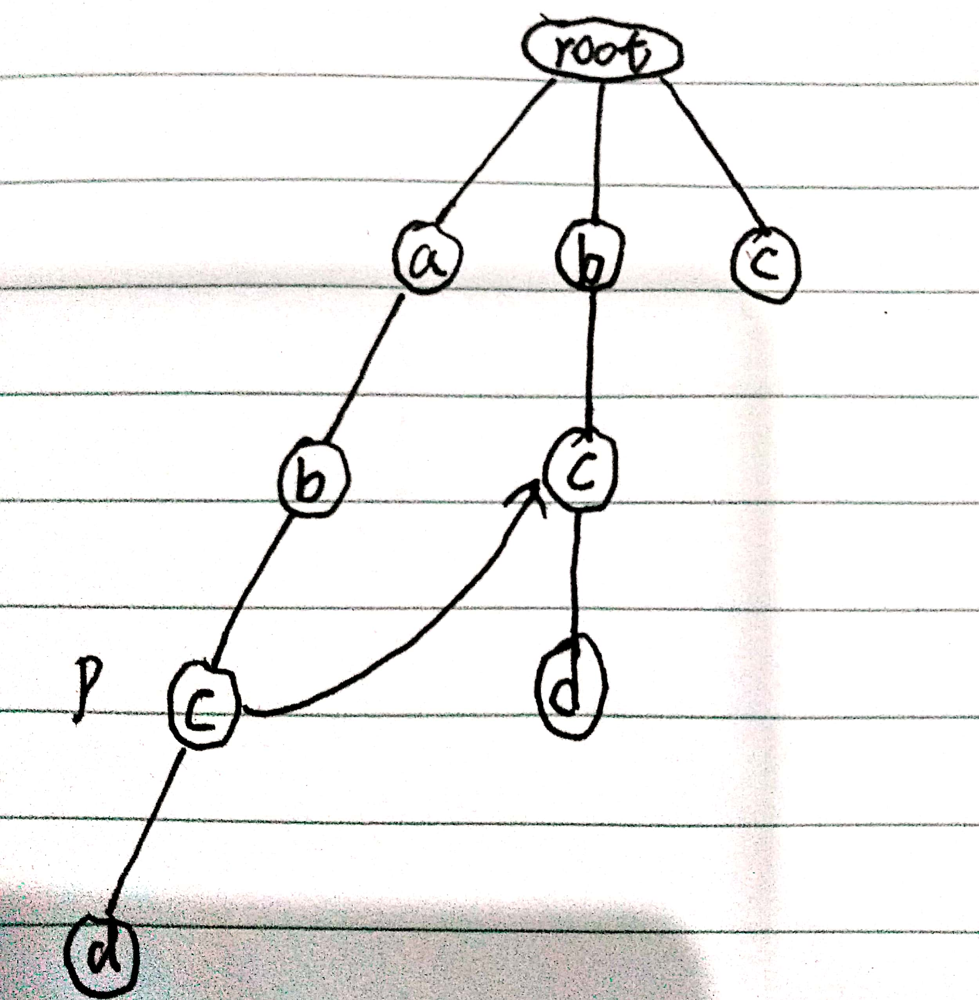
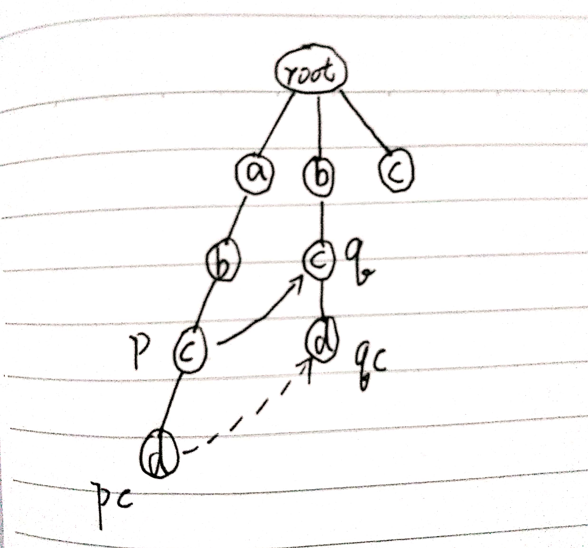
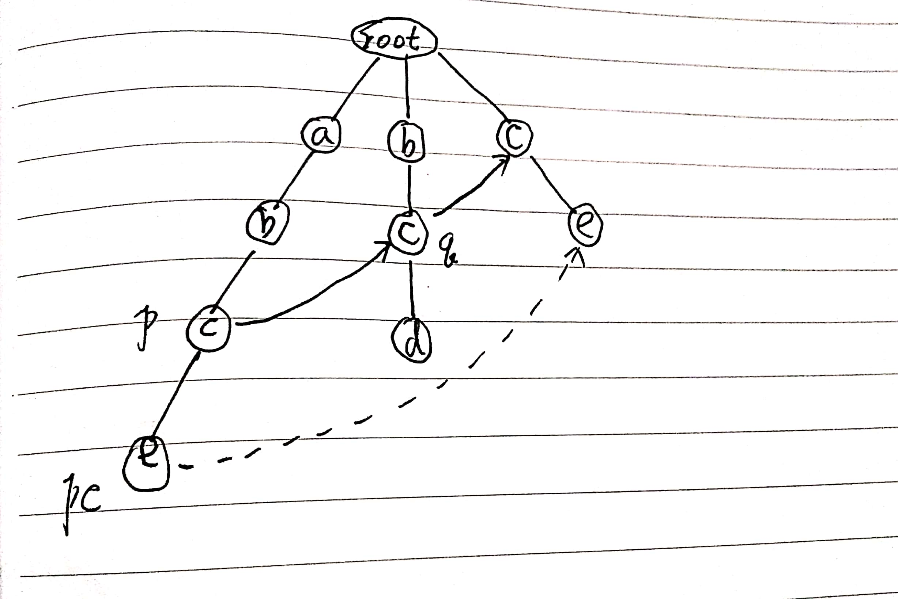
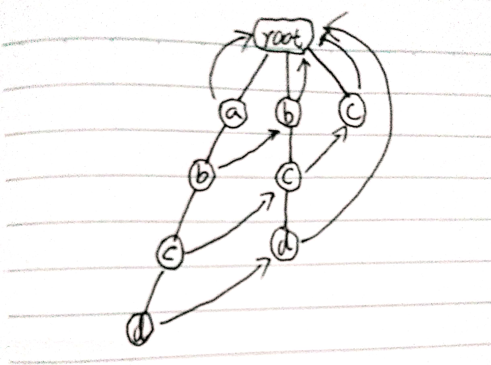

# AC自动机：如何用多模式串匹配实现敏感词过滤功能

学习来源：[数据结构与算法之美-36](https://time.geekbang.org/column/article/72810)

## 基于单模式串和Trie树实现的敏感词过滤

前面讲了多个单模式串匹配算法，比如BF, RK, BM, KMP。多模式串匹配算法讲了Trie树。如果一个访问量很大的BBS或者网站要过滤用户发表文本，那么单模式串匹配算法就不能满足要求了。我们需要用到这一节要讲的AC自动机算法了。

## 经典的多模式串匹配算法： AC自动机

AC自动机算法，全程是Aho-Corasick算法。其实Trie树跟AC自动机之间的关系，就相当于单模式串中朴素的串匹配算法跟KMP算法一样，只不过前者针对的时多模式串而已。**AC自动机实际上就是在Trie树之上，加了类似KMP的next数组，只不过此处的next数组是构建在树上罢了**。代码表示如下：

```java
public class AcNode {
    public char data;
    public AcNode[] children = new AcNode[26];  // 字符串只包含a~z这26个字符
    public boolean isEndingChar = false;        // 结尾字符为true
    public int length = -1; // 当isEndingChar=true时，记录模式串长度
    public AcNode fail; // 失败指针
    public AcNode(char data) {
        this.data = data;
    }
}
```

所以AC自动机的构建，包含两个操作：

- 将多个模式串建成Trie树
- 在Trie树上构建失败指针(相当于KMP中的失效函数next数组)

如何构建Trie树在上一讲已经讲过了，着重看下**构建好Trie树之后，如何在它之上构建失败指针**?

比如有4个模式串，分别是c, bc, bcd, abcd；主串是abcd。



Trie树中的每一个节点都有一个失败指针，它的作用和构建过程，跟KMP算法中的next数组类似。

假设我们沿着Trie树走到p节点，那p的失败指针就是从root走到字符串abc，跟所有模式串前缀匹配的最长可匹配后缀子串，就是箭头指向的bc模式串。

我们从可匹配后缀子串中，找出最长的一个，就是刚刚讲到的最长可匹配后缀子串。我们将p节点的失败指针指向那个最长匹配后缀子串对应的模式串的前缀的最后一个节点，就是下图箭头指向的节点。



计算每个节点的失败指针这个过程看起来很复杂。其实，如果我们把树中相同深度的节点放到同一层，那么某个节点的失败指针只有可能出现在它所在层的上一层。我们可以像KMP算法那样，当我们要求某个节点的失败指针的时候，我们通过已经求得的、深度更小的那些节点的失败指针来推导。也就是说，我们可以逐层依次来求每个节点的失败指针。所以失败指针的构建过程，是一个按层遍历树的过程。

首先root的失败指针为NULL，也就是指向自己。当我们已经求得某个节点p的失败指针之后，如何寻找它的子节点的失败指针？

我们假设节点p的失败指针指向节点q，我们看节点p的子节点pc对应的字符，是否也可以在节点q的子节点中找到。如果找到了节点q的一个子节点qc，对应的字符跟节点pc对应的字符相同，则将节点pc的失败指针指向节点qc。



如果节点q中没有子节点的字符等于节点pc包含的字符，则另q=q->fail(fail表示失败指针)，继续上面的查找，知道q是root为止，如果还没有找到相同字符的节点，那就让节点pc的失败指针指向root。



构建的代码如下：

```java
public void buildFailurePointer() {
    Queue<AcNode> queue = new LinkedList<>();
    root.fail = null;
    queue.add(root);
    while (!queue.isEmpty()) {
        AcNode p = queue.remove();
        for (int i = 0; i < 26; ++i) {
            AcNode pc = p.children[i];
            if (pc == null) {
                pc.fail = root;
            } else {
                AcNode q = p.fail;
                while (q != null) {
                    AcNode qc = q.children[pc.data - 'a'];
                    if (qc != null) {
                        pc.fail = qc;
                        break;
                    }
                    q = q.fail;
                }
                if (q == null) {
                    pc.fail = root;
                }
            }
            queue.add(pc);
        }
    }
}
```

通过按层来计算每个节点的子节点的失败指针，刚刚举的例子，最后构建完成之后的AC自动机就是如下：



**如何在AC自动机上匹配主串**？

在匹配过程中，主串从i=0开始，AC自动机从指针p=root开始，假设模式串是b，主串是a。

- 如果p指向的节点有一个等于b[i]的子节点x，我们就更新p指向x，这个时候我们需要通过失败指针，检测一系列失败指针为结尾的路径是否是模式串。
- 如果p指向的节点没有等于b[i]的子节点，那失败指针就派上用场了，我们让p=p->fail，然后继续这2个过程。

关于匹配的这部分，可以对照下面的代码来理解：

```java
public void match(char[] text) {    // text是主串
    int n = text.length;
    AcNode p = root;
    for (int i = 0; i < n; i++) {
        int idx = text[i] - 'a';
        while (p.children[idx] == null && p != null) {
            p = p.fail; // 失败指针发挥作用的地方
        }
        p = p.children[idx];
        if (p == null) {
            p = root;   // 如果没有匹配的，从root开始重新匹配
        }
        AcNode tmp = p;
        while (tmp != root) {   // 打印出可以匹配的模式串
            if (tmp.isEndingChar) {
                int pos = i - tmp.length + 1;
                System.out.println("匹配起始下标 " + pos + "; 长度 " + tmp.length);
            }
            tmp = tmp.fail;
        }
    }
}
```

## 内容小结

AC自动机是基于Trie树的一种改进算法，它跟Trie树的关系，就像单模式串中，KMP算法与BF算法的关系一样。KMP算法中有一个非常关键的next数组，对应到AC自动机中的失败指针。
