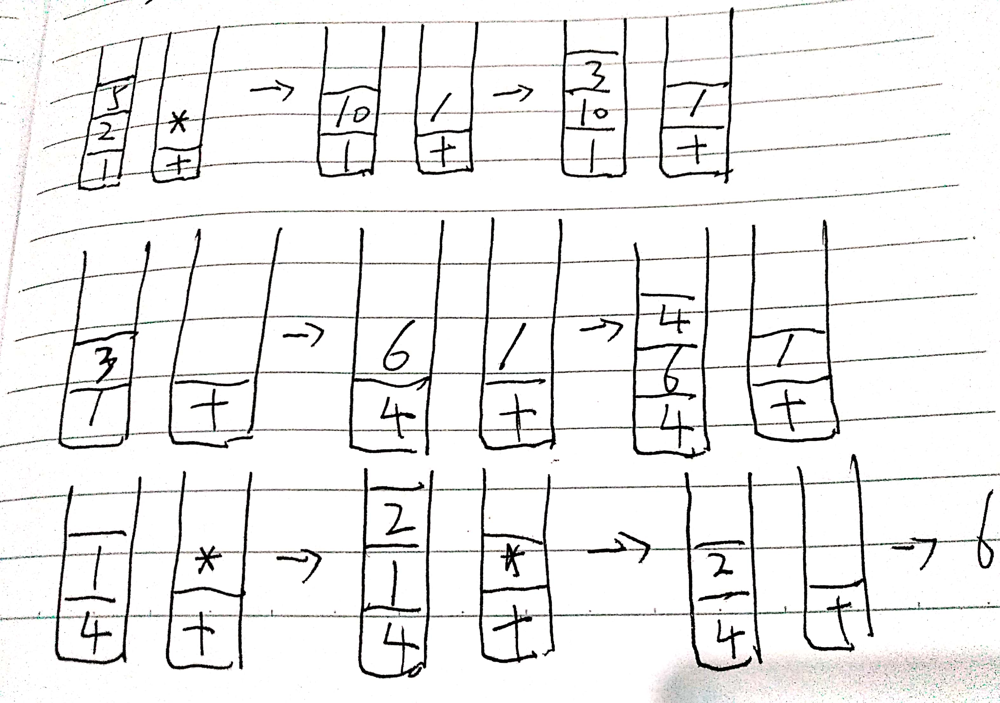

# BasicCalculator实现

leetcode227题，用栈来实现一个不带括号的四则混合运算。之前在极客时间上看到过王争老师讲的思路，用2个栈来实现。其中一个栈保存操作数，一个栈保存运算符。从左往右遍历表达式，遇到数字，直接压入操作数栈；遇到运算符，就与运算符栈顶的元素进行比较。

如果比运算符栈顶的优先级高，则将当前运算符出栈；如果比栈顶优先级低或者相等，从运算符栈顶取出运算符，从操作数栈取出2个数字，进行计算，然后把计算结果压入操作数栈，继续比较。

举个例子：1+2*5/3+6/4*2



流程理解起来很简单，但是代码实现并不容易，半天才修完bug通过了leetcode的单元测试。通过看讨论留言中，发现有大神用一个栈就实现了，代码简单优雅：

```java
public int calculate(String s) {
    int len;
    if (s == null || (len = s.length()) == 0) {
        return 0;
    }
    Stack<Integer> stack = new Stack<>();
    int num = 0;
    char sign = '+';
    for (int i = 0; i < len; i++) {
        if (Character.isDigit(s.charAt(i))) {
            num = num * 10 + s.charAt(i) - '0';
        }
        if ((!Character.isDigit(s.charAt(i)) && ' ' != s.charAt(i) || i == len - 1)) {
            if (sign == '-') {
                stack.push(-num);
            }
            if (sign == '+') {
                stack.push(num);
            }
            if (sign == '*') {
                stack.push(stack.pop()*num);
            }
            if (sign == '/') {
                stack.push(stack.pop()/num);
            }
            sign = s.charAt(i);
            num = 0;
        }
    }

    int re = 0;
    for (int i : stack) {
        re += i;
    }
    return re;
}
```
