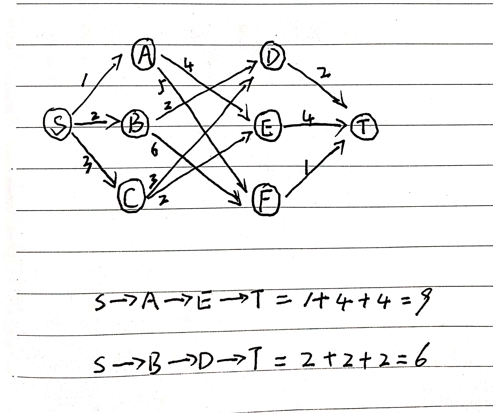

# 贪心算法

学习来源：[数据结构与算法之美-37](https://time.geekbang.org/column/article/73188)

贪心算法经常应用的场景，比如背包问题，最短路径，都需要用到贪心算法的思想来解决。

假设有一个可以容纳100kg的背包，需要从5种豆子中装的价值最大，应该如何选择装那些豆子？每周要装多少呢？

| 物品 | 总量(kg) | 总价值(元) |
|---|-----|-------|
| 黄豆 | 100 | 100 |
| 绿豆 | 30 | 90 |
| 红豆 | 60 | 120 |
| 黑豆 | 20 | 80 |
| 青豆 | 50 | 75 |

实际上，我们一眼就能看出来，应该选择顺序是20kg黑豆，30kg绿豆，50kg红豆。

贪心算法解决问题的步骤：

**第一步**，当我们看到这类问题时候，首先要联想到贪心算法：针对一组数据，我们定义了限制值和期望值，希望从中选几个数据，在满足限制值的情况下期望值最大。

**第二步**，我们尝试看下这个问题是否可以用贪心算法解决：每次选择当前情况下，在对限制值同等贡献的情况下，对期望值共享最大的数据。

**第三步**，我们举例看下贪心算法产生的结果是否最优解。大部分情况下，举几个例子验证就可以了。严格的证明贪心算法正确性，是非常复杂的，需要涉及比较多的数学推理。

实际上，用贪心算法解决问题的思路，不一定都是最优解。例如下图从顶点S出发，找到一条到顶点T的最短路径（路径的边权值最小）。贪心算法的思路是，每次都选一条跟当前订单相连权值最小的边，直到顶点T。按照这个思路，最短路径是S->A->E->T，长度是9。

实际上，路径S->B->D->T才是最短路径。

在这个问题，贪心算法不工作的原因是，前面的选择会影响后面的选择。

## 贪心算法实战分析

### 1. 分糖果

我们有m个糖果和n个孩子，m个糖果的大小分别是s1,s2,s3...sm。每个孩子对糖果的需求是g1,g2,g3...gn。

如何分糖果，才能尽可能多的满足孩子。

我们现在用贪心算法来解决。对于一个孩子来说，如果小的糖果可以满足，就没必要用更大的糖果，这样大的糖果可以留给需求更大的孩子。我们每次从剩下的孩子中，找出对糖果需求最小的，然后发给他剩下的糖果中能满足他需求的最小的糖果，这样的分配方案也是能满足孩子个数最多的方案。

### 2. 钱币找零

假设我们有1元，2元，5元，10元，20元，50元，100元的钱币，张数分别为c1,c2,c5,c10,c20,c50,c100。现在用这些钱来支付K元，最少要用多少张钱币呢？

在生活中，我们肯定是用面纸最大的来支付，如果不够，继续用小一点面纸的，以此类推。在贡献值（纸币数目）相同的情况下，我们希望多贡献点金额，这样就可以让纸币数更少，这就是一种贪心算法。

### 3. 区间覆盖

假设我们有n个区间，区间的起始端点和结束端点分别是[l1,r1],[l2,r2],[l3,r3],......,[ln,rn]。我们从这n个区间中选出一部分区间，这部分区间两两不相交（端点相交的情况不算），最多能选出多少个区间？

区间：[6,8],[2,4],[3,5],[1,5],[5,9],[8,10]

不相交区间：[2,4],[6,8],[8,10]

## 用贪心算法实现Huffman压缩编码

假设有6个字符a，b，c，d，e，f。我们把它们编码为下面的样子，任何一个字符的编码都不是另外一个的前缀，在解压缩的时候，我们每次会读取尽可能长的可解压的二进制串，所以解压缩的时候也不会歧义。

| 字符 | 出现频率 | 编码 | 总二进制位数 |
|---|-----|---|-------|
| a | 450 | 1 | 450 |
| b | 350 | 01 | 700 |
| c | 90 | 001 | 270 |
| d | 60 | 0001 | 240 |
| e | 30 | 00001 | 150 |
| f | 20 | 00000 | 100 |

我们把每个字符看成一个节点，并且附带着把频率放到优先队列中。我们从队列取出频率最小的2个节点A、B，然后新建一个节点C，把频率设置为两个节点的频率之和，并把这个新节点C作为节点A、B的父节点。最后把C节点加入优先队列中。重复这个过程，直到队列中没有数据。

现在，我们给每一条边增加一个权值，指向左子节点的边标记为0，指向右子节点的边，我们标记为1，从根节点到叶子节点的路径就是叶子节点的霍夫曼编码。

