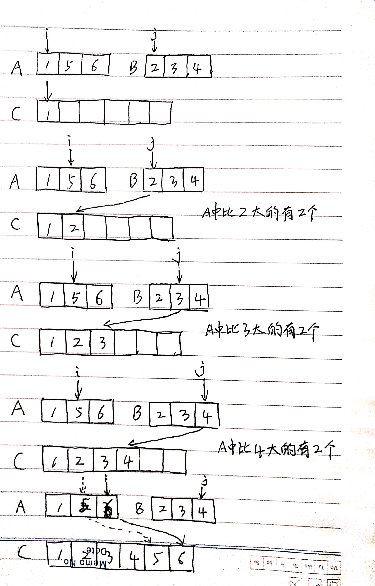

# 使用归并算法计算逆序度

学习来源：[数据结构与算法之美-38](https://time.geekbang.org/column/article/73503)

在排序的章节中，我们学到了逆序度的概念。逆序度用来表示一组数据的无序程度。对于n个数据从小到大排序，完全有序的数据有序度是n(n-1)/2，逆序度是0。反之，有序度是0，逆序度是n(n-1)/2。

用最直接的方法求逆序度，拿每个数字跟后面的数字来进行比较，把比它小的个数记作k，遍历完成后把每次的k加起来。这样操作的时间复杂度是O(n^2)，如果要有效率的球逆序度，这里可以使用归并排序巧妙的完成。

我们用分治法，把一个数组A分为前后两半A1和A2，分别计算A1和A2的逆序个数k1和k2，然后再计算A1与A2之间的逆序对个数k3。那数组A的逆序个数等于k1+k2+k3。



代码展示:

```java
public class ReverseOrderCount {
    private int num = 0;

    public int count(int[] a, int n) {
        num = 0;
        mergeSortCounting(a, 0, n - 1);
        return num;
    }

    private void mergeSortCounting(int[] a, int p, int r) {
        if (p >= r) {
            return;
        }
        int q = (p + r) / 2;
        mergeSortCounting(a, p, q);
        mergeSortCounting(a, q + 1, r);
        merge(a, p, q, r);
    }

    private void merge(int[] a, int p, int q, int r) {
        int i = p, j = q + 1, k = 0;
        int[] tmp = new int[r - p + 1];
        while (i <= q && j <= r) {
            if (a[i] <= a[j]) {
                tmp[k++] = a[i++];
            } else {
                num += (q - i + 1);
                tmp[j++] = a[j++];
            }
        }

        while (i <= q) {
            tmp[k++] = a[i++];
        }

        while (j <= r) {
            tmp[k++] = a[j++];
        }

        for (i = 0; i < r - p + 1; i++) {
            a[p + i] = tmp[i];
        }
    }

    public static void main(String[] args) {
        int[] a = new int[]{2, 4, 3, 1, 5, 6};
        int n = a.length;
        System.out.println(new ReverseOrderCount().count(a, n));
    }
}
```
