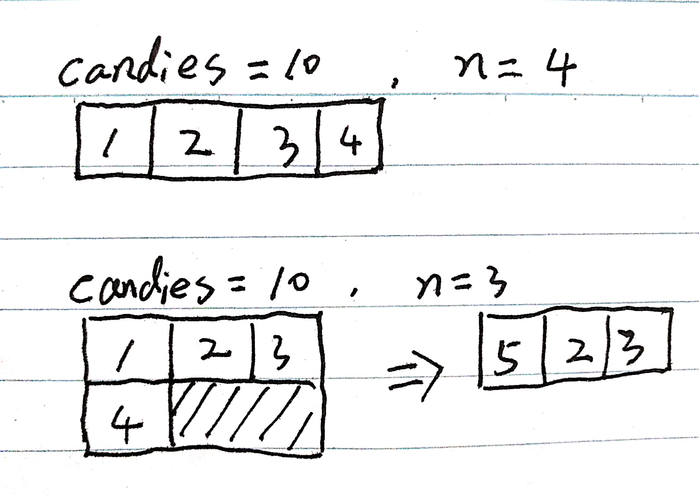
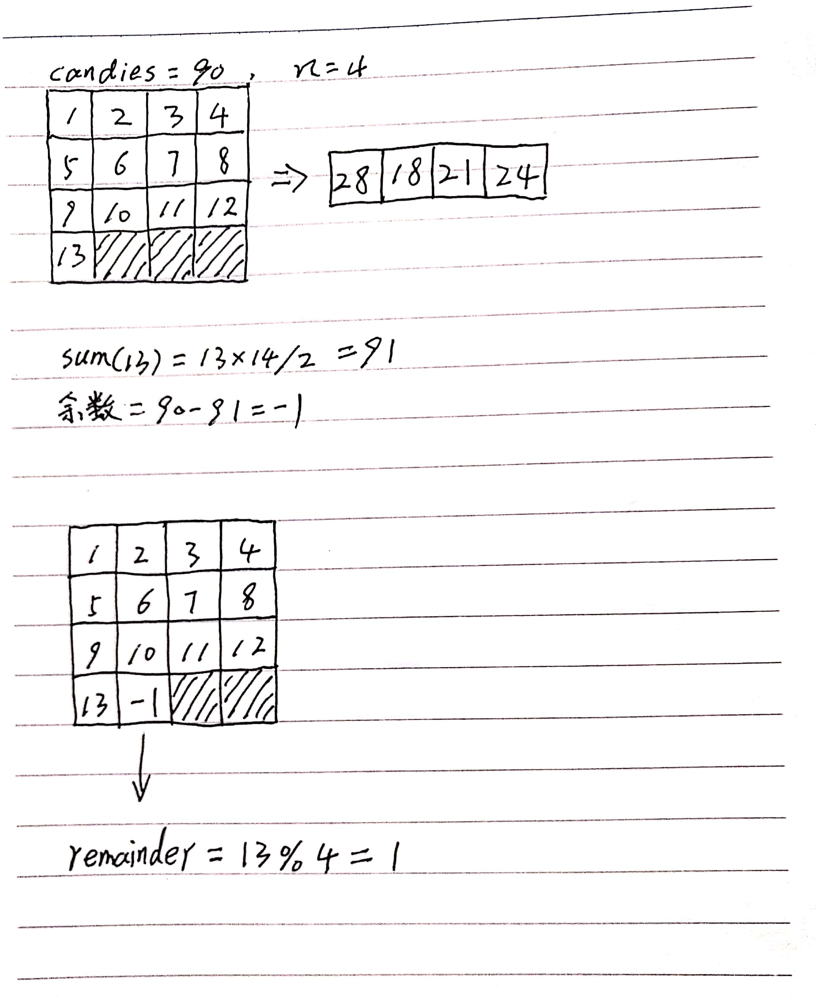

# leetcode1103分糖果解题思路

## 1. 题目

```txt
We distribute some number of candies, to a row of n = num_people people in the following way:

We then give 1 candy to the first person, 2 candies to the second person, and so on until we give n candies to the last person.

Then, we go back to the start of the row, giving n + 1 candies to the first person, n + 2 candies to the second person, and so on until we give 2 * n candies to the last person.

This process repeats (with us giving one more candy each time, and moving to the start of the row after we reach the end) until we run out of candies.  The last person will receive all of our remaining candies (not necessarily one more than the previous gift).

Return an array (of length num_people and sum candies) that represents the final distribution of candies.
```

## 2. 个人分析

先用几个示例分析下:



首先要计算candies个糖果分配给n个人，最后一个分的剩余糖果的前一个人应该获得多少糖果，如果最后一个正好够分，则找这个人分到的糖果数。我们都知道从1开始递增，第n个数和前面所有的数加起来的总和可以使用公式sum=n*(n + 1) / 2来计算，因此我们算最后一个够分的数字n可以近似的用下面公式来计算：

$\sqrt[2]{sum\times2}$

通过这个公式计算的结果再往下取整就是最后一个和前面分配规则一样的分配个数，通过Java实现：

```java
private int calMaxFullElement(int candies) {
    return (int) Math.floor(Math.sqrt(candies * 2));
}

private int sum(int n) {
    return n * (n + 1) / 2;
}
```

剩余的糖果数就是糖果总数减去最后一个按规则分配个数和前面所有的数字之和：

```java
int surplus = candies - sum(maxFullIndex);
```

这样maxFullIndex之前所有的人分配情况可以这样写：

```java
for (int i = 0; i < maxFullIndex; i++) {
    peopleContains[i % num_people] += (i + 1);
}
```

这样提交发现如果糖果数为90，分配人数为4，结果就会错误，发现剩余的糖果数可能为负数，画图表示下：



如果余数为负数，就需要考虑最后分剩余糖果的人是在n个人中的第几位，如果是第一位需要从第n位分到的结果减，其他情况则从上一位减少，代码表示为：

```java
int remainder = maxFullIndex % num_people;
if (surplus > 0) {
    peopleContains[remainder] += surplus;
} else if (surplus < 0) {
    if (remainder == 0) {
        peopleContains[num_people - 1] += surplus;
    } else {
        peopleContains[remainder - 1] += surplus;
    }
}
```

## 3. 优雅的实现

虽然以上我自己的方法实现起来也是时间复杂度为O(n)，看了下讨论板块发现一个很有意思的实现，代码量非常少缺能把所有情况都考虑进去：

```java
public int[] simpleDistributeCandies(int candies, int n) {
    int[] res = new int[n];
    for (int i = 0; candies > 0; i++) {
        res[i % n] += Math.min(candies, i + 1);
        candies -= i + 1;
    }
    return res;
}
```

循环条件中终止条件为判断剩余糖果数是否大于0，实现的更加优雅，才发现原来for循环可以这么玩！路途很遥远，加油吧！
