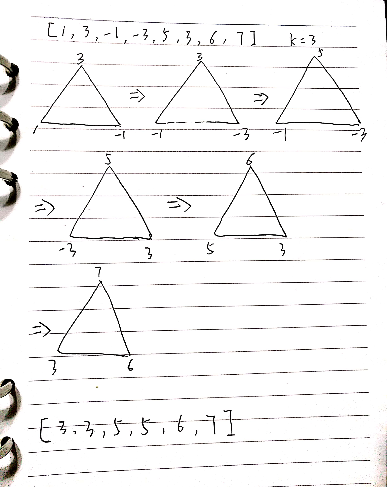

# leetcode239解题思路

题目：

```
Given an array nums, there is a sliding window of size k which is moving from the very left of the array to the very right. You can only see the k numbers in the window. Each time the sliding window moves right by one position. Return the max sliding window.

Example:

Input: nums = [1,3,-1,-3,5,3,6,7], and k = 3
Output: [3,3,5,5,6,7] 
Explanation: 

Window position                Max
---------------               -----
[1  3  -1] -3  5  3  6  7       3
 1 [3  -1  -3] 5  3  6  7       3
 1  3 [-1  -3  5] 3  6  7       5
 1  3  -1 [-3  5  3] 6  7       5
 1  3  -1  -3 [5  3  6] 7       6
 1  3  -1  -3  5 [3  6  7]      7
Note: 
You may assume k is always valid, 1 ≤ k ≤ input array's size for non-empty array.
```

## 解题思路

这个题的意思就是给定一个数组和一个数值k,从数组的第一个元素开始每次在k个大小的元素范围内找最大数，然后放到一个新的数组中，最后直到把整个数组遍历完输出最大数组的元素。这里可以根据Java的PriorityQueue的特性，构建一个大顶堆，每次放入k个元素，并将堆顶元素放入数组中。最后输出。


