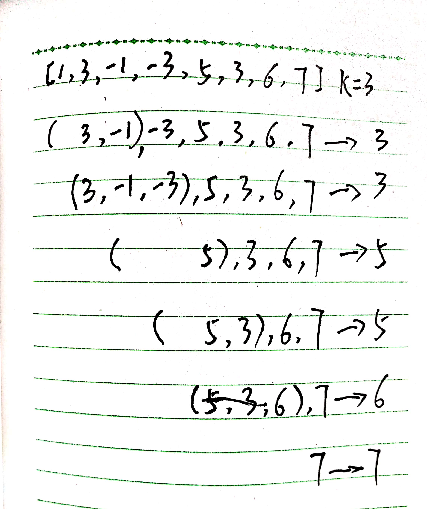

# leetcode239解题思路

题目：

```console
Given an array nums, there is a sliding window of size k which is moving from the very left of the array to the very right. You can only see the k numbers in the window. Each time the sliding window moves right by one position. Return the max sliding window.

Example:

Input: nums = [1,3,-1,-3,5,3,6,7], and k = 3
Output: [3,3,5,5,6,7]
Explanation:

Window position                Max
---------------               -----
[1  3  -1] -3  5  3  6  7       3
 1 [3  -1  -3] 5  3  6  7       3
 1  3 [-1  -3  5] 3  6  7       5
 1  3  -1 [-3  5  3] 6  7       5
 1  3  -1  -3 [5  3  6] 7       6
 1  3  -1  -3  5 [3  6  7]      7
Note:
You may assume k is always valid, 1 ≤ k ≤ input array's size for non-empty array.
```

## 解题思路1

这个题的意思就是给定一个数组和一个数值k,从数组的第一个元素开始每次在k个大小的元素范围内找最大数，然后放到一个新的数组中，最后直到把整个数组遍历完输出最大数组的元素。这里可以根据Java的PriorityQueue的特性，构建一个大顶堆，每次放入k个元素，并将堆顶元素放入数组中。最后输出。


## 解题思路2

可以使用双端队列来简化这个算法的时间复杂度。使用1个双端队列和一个数组，其中双端队列存储要返回的数组res下标，另外一个数组res返回数组。大体的思路分为下面几部：

1. 判断输入数组是否为空，不为空则继续
2. 定义一个长度为nums.length-k+1长度的数组和一个储存数组下标的双端队列window
3. 循环判断nums数组的每个元素
4. 返回res数组

循环的逻辑判断：

- 如果循环的下标i>=k并且window的最左元素<=i-k，说明窗口已经划出本次存储的下标，则将最左下标移出
- 如果存储下标的队列window不为空且每个window元素都小于本次循环的元素，移出所有window元素并把本次元素下标加入window
- 如果循环下标i>=k-1说明本次窗口要移出，将window最左下标对应的数组值nums[window.getFirst]放入res


