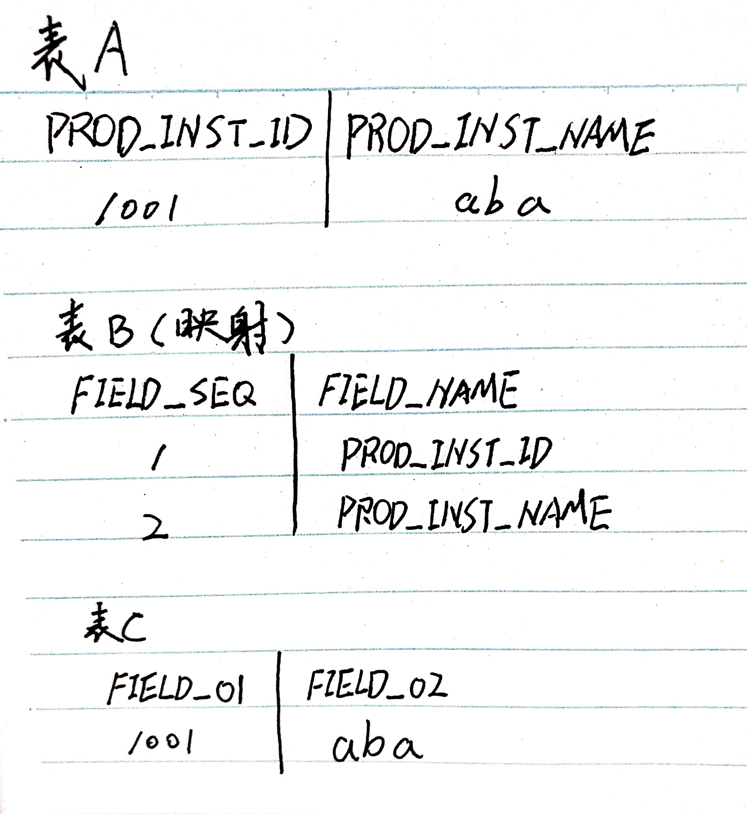
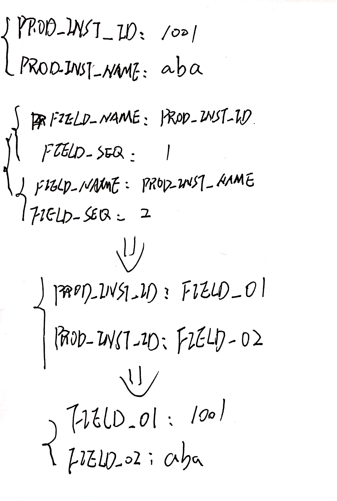

# 根据映射关系修改Map中的key

今天工作中有一个场景，从A表中取数据，经过B表字段映射后将结果写入C表，具体如下：



使用Map来做转换，测试代码如下：



```java
public static void main(String[] args) {
    Map<String, Object> excelMap = Maps.newHashMap();
    excelMap.put("PROD_INST_ID", 1001);
    excelMap.put("PROD_INST_NAME", "aaa");

    List<Map<String, Object>> headerList = Lists.newArrayList();
    Map<String, Object> headerMap1 = Maps.newHashMap();
    headerMap1.put("FIELD_NAME", "PROD_INST_ID");
    headerMap1.put("FIELD_SEQ", 1);
    Map<String, Object> headerMap2 = Maps.newHashMap();
    headerMap2.put("FIELD_NAME", "PROD_INST_NAME");
    headerMap2.put("FIELD_SEQ", 2);
    headerList.add(headerMap1);headerList.add(headerMap2);

    Map<String, Object> headerReverseMap = Maps.newHashMap();
    for (Map<String, Object> headerMap : headerList) {
        String columnName = String.valueOf(headerMap.get("FIELD_NAME"));
        Integer columnIndex = (Integer) headerMap.get("FIELD_SEQ");

        String fieldIndexName = "";
        if (columnIndex.intValue() < 10) {
            fieldIndexName = "FIELD_0" + columnIndex.intValue();
        } else {
            fieldIndexName = "FIELD_" + columnIndex.intValue();
        }
        headerReverseMap.put(columnName, fieldIndexName);
    }

    Map<String, Object> resultMap = Maps.newHashMap();
    for (Map.Entry entry: excelMap.entrySet()) {
        String key = (String) entry.getKey();
        Object value = entry.getValue();
        resultMap.put(String.valueOf(headerReverseMap.get(key)), value);
    }


    System.out.println(resultMap);
}
```

运行结果：

```console
{FIELD_01=1001, FIELD_02=aaa}
```
