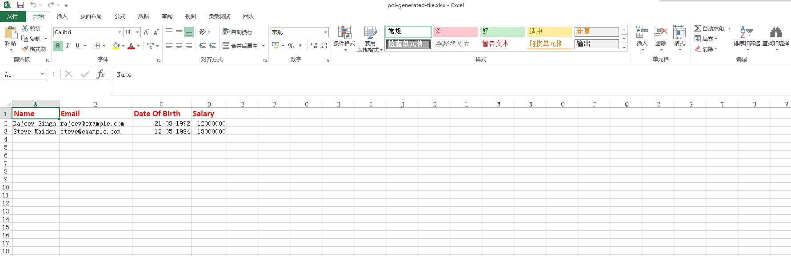

# Java中使用Apache POI写入Excel文件

[原文链接](https://www.callicoder.com/java-write-excel-file-apache-poi/)

这篇文章将会介绍使用Apache POI创建并写入Excel文件。

可以查看[前一篇](https://www.callicoder.com/java-read-excel-file-apache-poi/)学习Apache POI的高级架构和如何使用Apache POI库从Excel读取数据。

## 依赖

你应该增加下面的依赖项将Apache POI引入到你的工程中。

### Maven

```pom.xml
<!-- Used to work with the older excel file format - `.xls` -->
<!-- https://mvnrepository.com/artifact/org.apache.poi/poi -->
<dependency>
    <groupId>org.apache.poi</groupId>
    <artifactId>poi</artifactId>
    <version>3.17</version>
</dependency>

<!-- Used to work with the newer excel file format - `.xlsx` -->
<!-- https://mvnrepository.com/artifact/org.apache.poi/poi-ooxml -->
<dependency>
    <groupId>org.apache.poi</groupId>
    <artifactId>poi-ooxml</artifactId>
    <version>3.17</version>
</dependency>
```

### Gradle

```gradle
compile "org.apache.poi:poi:3.17"	     // For `.xls` files
compile "org.apache.poi:poi-ooxml:3.17"	 // For `.xlsx` files
```

## 使用POI写入Excel文件

先创建一个简单的Employee类

```java
class Employee {
    private String name;
    private String email;
    private Date dateOfBirth;
    private double salary;

    public Employee(String name, String email, Date dateOfBirth, double salary) {
        this.name = name;
        this.email = email;
        this.dateOfBirth = dateOfBirth;
        this.salary = salary;
    }

    // Getters and Setters (Omitted for brevity)
}
```

下面看下用程序创建excel文件并写数据。注意这里使用XSSFWorkbook来创建Workbook实例。这里会生成新的XML格式的excel文件(.xlsx)。你也可以使用HSSFWorkbook来创建老版本的excel格式(.xls)。

```java
import org.apache.poi.openxml4j.exceptions.InvalidFormatException;
import org.apache.poi.ss.usermodel.*;
import org.apache.poi.xssf.usermodel.XSSFWorkbook;

import java.io.FileOutputStream;
import java.io.IOException;
import java.util.ArrayList;
import java.util.Calendar;
import java.util.Date;
import java.util.List;

public class ExcelWriter {

    private static String[] columns = {"Name", "Email", "Date Of Birth", "Salary"};
    private static List<Employee> employees =  new ArrayList<>();

    // Initializing employees data to insert into the excel file
    static {
        Calendar dateOfBirth = Calendar.getInstance();
        dateOfBirth.set(1992, 7, 21);
        employees.add(new Employee("Rajeev Singh", "rajeev@example.com", 
                dateOfBirth.getTime(), 1200000.0));

        dateOfBirth.set(1965, 10, 15);
        employees.add(new Employee("Thomas cook", "thomas@example.com", 
                dateOfBirth.getTime(), 1500000.0));

        dateOfBirth.set(1987, 4, 18);
        employees.add(new Employee("Steve Maiden", "steve@example.com", 
                dateOfBirth.getTime(), 1800000.0));
    }

    public static void main(String[] args) throws IOException, InvalidFormatException {
        // Create a Workbook
        Workbook workbook = new XSSFWorkbook(); // new HSSFWorkbook() for generating `.xls` file

        /* CreationHelper helps us create instances of various things like DataFormat, 
           Hyperlink, RichTextString etc, in a format (HSSF, XSSF) independent way */
        CreationHelper createHelper = workbook.getCreationHelper();

        // Create a Sheet
        Sheet sheet = workbook.createSheet("Employee");

        // Create a Font for styling header cells
        Font headerFont = workbook.createFont();
        headerFont.setBold(true);
        headerFont.setFontHeightInPoints((short) 14);
        headerFont.setColor(IndexedColors.RED.getIndex());

        // Create a CellStyle with the font
        CellStyle headerCellStyle = workbook.createCellStyle();
        headerCellStyle.setFont(headerFont);

        // Create a Row
        Row headerRow = sheet.createRow(0);

        // Create cells
        for(int i = 0; i < columns.length; i++) {
            Cell cell = headerRow.createCell(i);
            cell.setCellValue(columns[i]);
            cell.setCellStyle(headerCellStyle);
        }

        // Create Cell Style for formatting Date
        CellStyle dateCellStyle = workbook.createCellStyle();
        dateCellStyle.setDataFormat(createHelper.createDataFormat().getFormat("dd-MM-yyyy"));

        // Create Other rows and cells with employees data
        int rowNum = 1;
        for(Employee employee: employees) {
            Row row = sheet.createRow(rowNum++);

            row.createCell(0)
                    .setCellValue(employee.getName());

            row.createCell(1)
                    .setCellValue(employee.getEmail());

            Cell dateOfBirthCell = row.createCell(2);
            dateOfBirthCell.setCellValue(employee.getDateOfBirth());
            dateOfBirthCell.setCellStyle(dateCellStyle);

            row.createCell(3)
                    .setCellValue(employee.getSalary());
        }

        // Resize all columns to fit the content size
        for(int i = 0; i < columns.length; i++) {
            sheet.autoSizeColumn(i);
        }

        // Write the output to a file
        FileOutputStream fileOut = new FileOutputStream("poi-generated-file.xlsx");
        workbook.write(fileOut);
        fileOut.close();

        // Closing the workbook
        workbook.close();
    }
}
```

上面的程序先创建一个workbook，然后创建一个名叫Employees的sheet页。创建完sheet后，紧接着就是创建表头、行、列。表头我们使用了不通的字体格式。

创建完表头后，我们创建了其余的行和列。最后使用了sheet.autoSizeColumn()来自适应列宽。最后写入到文件中，文件截图如下：



