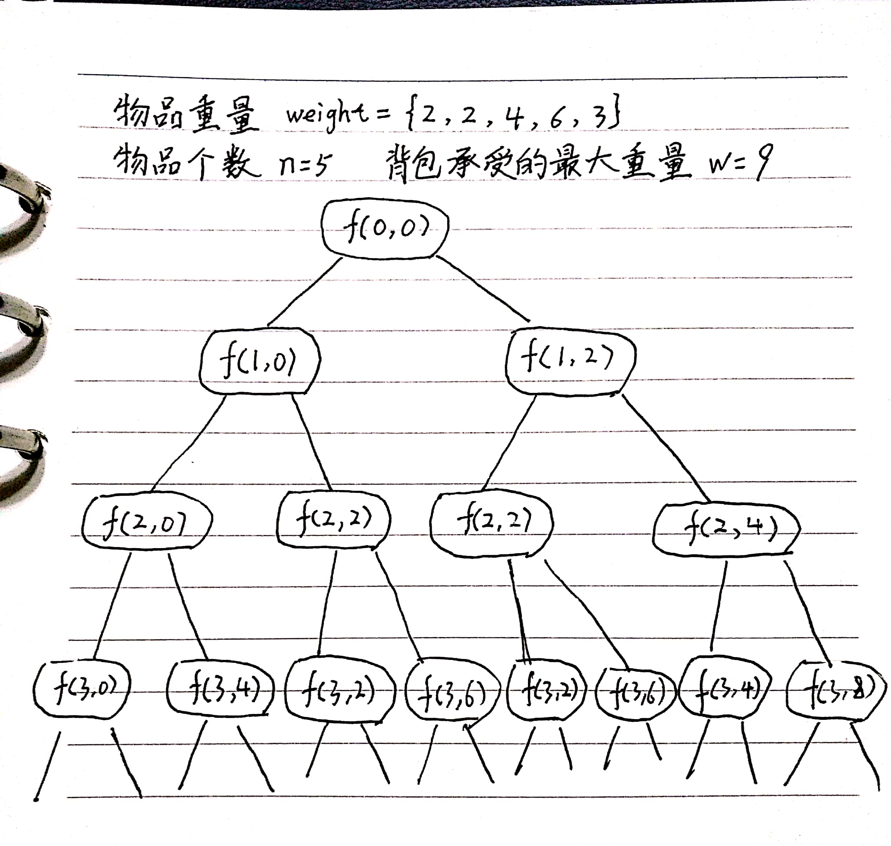
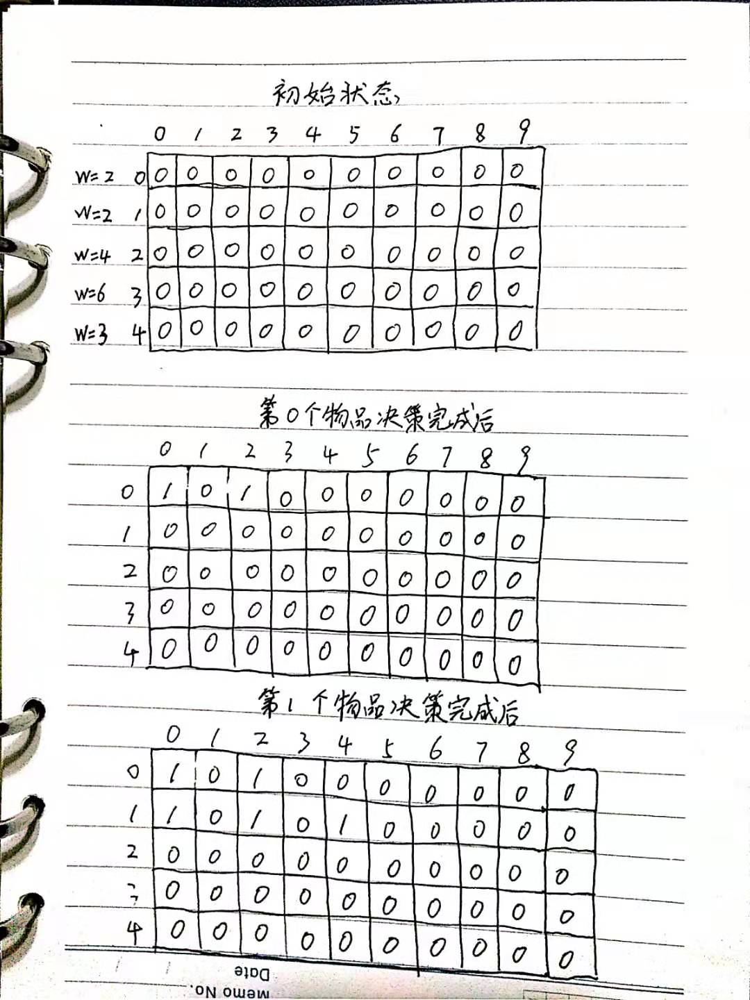
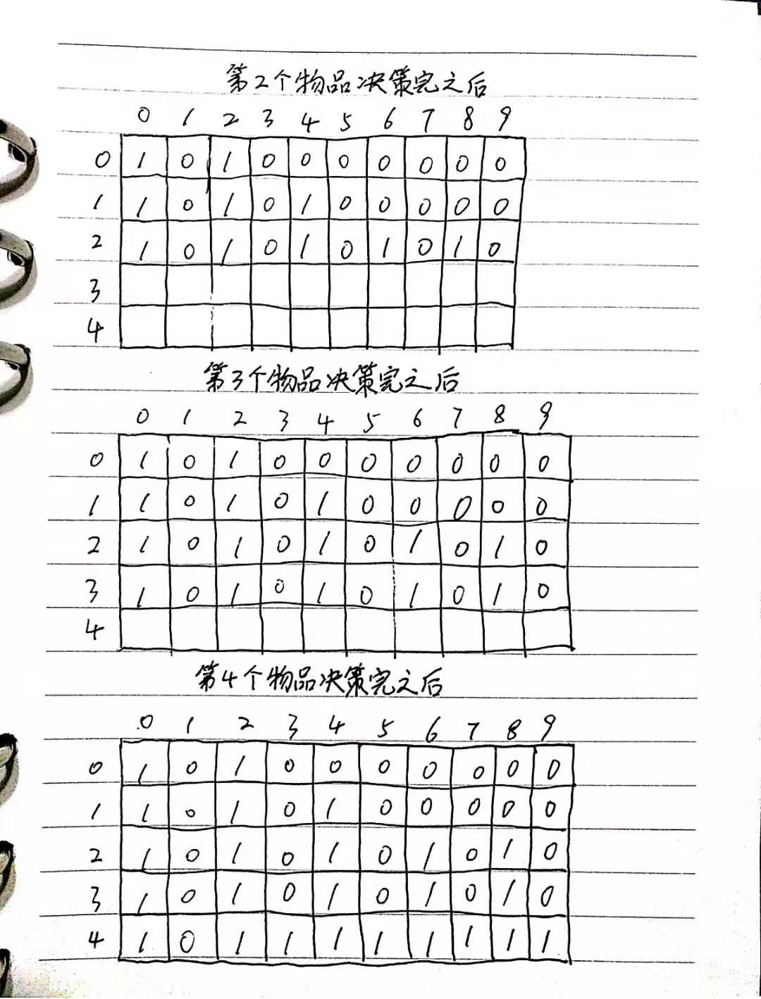

# 使用动态规划解决0-1背包问题

学习自：[数据结构与算法之美-40](https://time.geekbang.org/column/article/74788)

把前面回朔算法实现0-1背包问题的代码稍作修改，将输入变量都定义为成员变量。

```java
private int maxW = Integer.MIN_VALUE; // 结果放到 maxW 中
private int[] weight = {2，2，4，6，3};  // 物品重量
private int n = 5; // 物品个数
private int w = 9; // 背包承受的最大重量
public void f(int i, int cw) { // 调用 f(0, 0)
  if (cw == w || i == n) { // cw==w 表示装满了，i==n 表示物品都考察完了
    if (cw > maxW) maxW = cw;
    return;
  }
  f(i+1, cw); // 选择不装第 i 个物品
  if (cw + weight[i] <= w) {
    f(i+1,cw + weight[i]); // 选择装第 i 个物品
  }
}
```

把逻辑用图展示出来：



递归中f(2,2)和f(3,4)被重复计算了2次。记录“备忘录”来减少重复计算:

```java
private int maxW = Integer.MIN_VALUE; // 结果放到 maxW 中
private int[] weight = {2，2，4，6，3};  // 物品重量
private int n = 5; // 物品个数
private int w = 9; // 背包承受的最大重量
private boolean[][] mem = new boolean[5][10]; // 备忘录，默认值 false
public void f(int i, int cw) { // 调用 f(0, 0)
  if (cw == w || i == n) { // cw==w 表示装满了，i==n 表示物品都考察完了
    if (cw > maxW) maxW = cw;
    return;
  }
  if (mem[i][cw]) return; // 重复状态
  mem[i][cw] = true; // 记录 (i, cw) 这个状态
  f(i+1, cw); // 选择不装第 i 个物品
  if (cw + weight[i] <= w) {
    f(i+1,cw + weight[i]); // 选择装第 i 个物品
  }
}
```

这个减少了重复计算，已经很接近动态规划了，我们看下动态规划是怎么做的。定义一个二维数组states[n][w+1]来记录每层可以达到的不同状态。

第0个选择装入或者不装入，对应的states[0][0]=true和states[0][2]=true来表示这两种状态。

第1个物品重量也是2，基于之前背包状态，在这个物品决策后，有3个状态，背包状态f恩别是0,2,4。我们用states[1][0]=true,states[1][2]=true,states[1][4]=true来表示这3种状态。以此类推，直到所有物品都决策完。找一个值为true的最接近9的就是背包总重量的最大值。


<br/>


代码实现如下：

```java
// weight: 物品重量，n: 物品个数，w: 背包可承载重量
public int knapsack(int[] weight, int n, int w) {
  boolean[][] states = new boolean[n][w+1]; // 默认值 false
  states[0][0] = true;  // 第一行的数据要特殊处理，可以利用哨兵优化
  if (weight[0] <= w) {
    states[0][weight[0]] = true;
  }
  for (int i = 1; i < n; ++i) { // 动态规划状态转移
    for (int j = 0; j <= w; ++j) {// 不把第 i 个物品放入背包
      if (states[i-1][j] == true) states[i][j] = states[i-1][j];
    }
    for (int j = 0; j <= w-weight[i]; ++j) {// 把第 i 个物品放入背包
      if (states[i-1][j]==true) states[i][j+weight[i]] = true;
    }
  }
  for (int i = w; i >= 0; --i) { // 输出结果
    if (states[n-1][i] == true) return i;
  }
  return 0;
}
```
