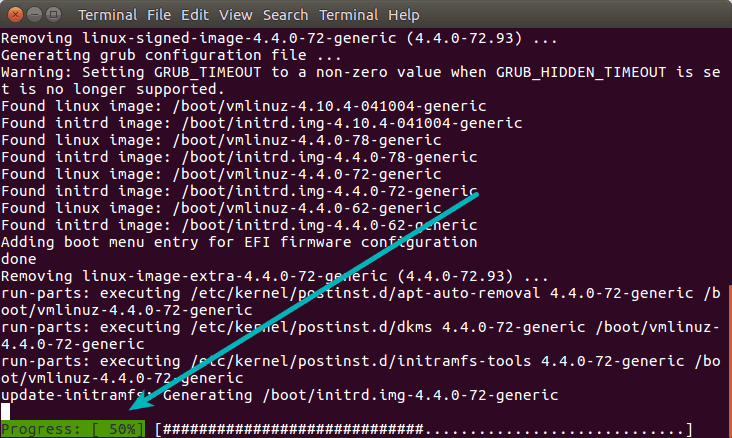
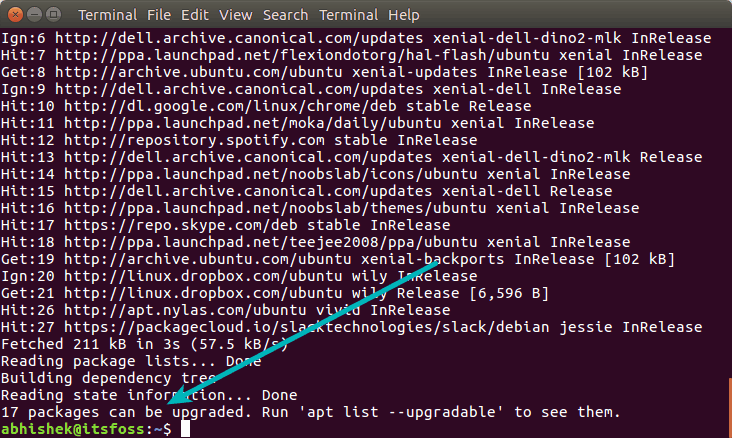

# apt和apt-get的不同解释

## 概要

这篇文章解释了在Linux命令中apt和apt-get的不同。同样列出了大多数常用的apt命令用来替换旧的apt-get命令。

Ubuntu16.04的一个显著的新特性是介绍了apt命令。事实上第一个稳定版本的apt命令从2014年就上线了，但是知道2016年通过Ubuntu16.04才被大多数人注意到。

apt install package用来替换更常见的apt-get install package。终于，其他发行版也跟随Ubuntu的脚步开始用apt来代替apt-get命令。

你可能有点好奇这两个有什么不同？他们都有共同的结构，新的apt命令需要什么呢？你可能在想如果apt命令比apt-get更好用？你会开始使用apt命令还是坚持使用apt-get命令？

我将在这篇文章给你解释这个问题然后希望你看完本文后你会更清楚。

## apt vs apt-get

仅仅是为了Linux Mint用户的快捷命令。几年前，Linux Mint实现了python包装器叫做apt实际上用的是apt-get但是相比有了更多友好的选项。这里我们讨论的apt和Linux Mint的apt不是一回事。

在我们看apt和apt-get的不同之前，让我们进入这些命令的背景看看到底是为了实现什么。

## 为什么apt首先被介绍

Debian，Linux早期的发行版，Ubuntu，Linux Mint，elementary OS等等都是基于Debian构建的，包含一个健壮的包管理系统，在你的系统上所有的组件和应用都构建到包中。Debian使用了一套叫做Advanced Packing Tool(APT)的工具来管理包管理系统。不要和apt命令混淆了，不是一回事。

在基于Debian的Linux系统可以使用APT可以允许你安装、移除和管理包来影响各种各样的工具。apt-get就是非常受欢迎的一个命令行工具。另外一个流行的工具是Aptitude同时包含命令行和图形界面。

如果你读过我的[guide on apt-get commands](https://itsfoss.com/apt-get-linux-guide/)，你可能遇到了一些熟悉的命令例如apt-cache。这也是问题出现的地方。

你知道，那些命令是很底层的并且包含了很多功能，大多数用户从来都用不上。另一方面，大多数常用的包管理命令都分散在apt-get和apt-cache上。

apt命令介绍就是为了解决这个问题。apt由大多数常用的apt-get和apt-cache特性构成。它可以管理apt.conf文件。

使用apt，你不需要从apt-get命令到apt-cache。apt提供了你需要管理包的常用选项。

## apt和apt-get的不同

所以apt，在一个地方得到了所有必须的。你将会丢弃大多数的命令选项。apt主要的目的就是提供一个高效的途径来给愉快的终端用户。

当Debian说出愉快的终端用户，它其实已经做到了。它有很少但是足够的命令行选项。最重要的是，它默认开启了一些对于终端用户很有帮助的选项。

例如，你在安装或者卸载程序的时候需要看进度条。

当你升级包的时候apt也提示你包的大小。

## apt和apt-get命令的不同

apt含有一些和apt-get相似的命令选项，它不是向后兼容的。意思是如果你仅仅替换apt-get的部分选项到apt命令可能无法正常工作。

让我们看下哪个apt命令替换了哪些apt-get和apt-cache的命令：

| apt command | the command it replaces | function of the command |
|---|-------|-------|
| apt install | apt-get install | Install a package |
| apt | remove apt-get | remove Removes | a | package |
| apt | purge apt-get | purge Removes | package | with | configuration |
| apt | update apt-get | update Refreshes | repository | index |
| apt | upgrade apt-get | upgrade Upgrades | all | upgradable | packages |
| apt | autoremove apt-get | autoremove Removes | unwanted | packages |
| apt | full-upgrade apt-get | dist-upgrade Upgrades | packages | with | auto-handling | of | dependencies |
| apt | search apt-cache | search Searches | for | the | program |
| apt | show apt-cache | show Shows | package | details |

apt还有一些独有的命令：

| apt new command | function of command |
|-----|-------|
| app list | Lists packages with criteria (installed, upgradable etc) |
| apt edit-sources | Edits sources list |

有一点要注意的是apt在不断开发中。所以后面你会看到新的选项个特性增加。

## apt-get作废了吗

我没有找到任何信息说apt-get会作废掉。事实上也不会有。它比起apt依旧提供了更多的功能。

底层操作，脚本等等，apt-get仍然会被使用。

## 我应该使用apt还是apt-get

你应该考虑下使用哪个。作为一个正常的Linux用户，都应该使用apt。

apt命令是Linux发行版推荐的命令。它提供了必要的选项来管理包。更重要的是，它更容易使用也更容易记住那些选项。我认为没有理由坚持使用apt-get除非你打算利用更多的apt-get的特殊选项。

## 结论

我希望我解释清楚了apt和apt-get的不同。最后，总结下apt和apt-get的结论：

- apt是apt-get和apt-cache的子集提供了必要的包管理命令
- apt-get没有作废，作为一个正常用户，应该开始更多的使用apt
