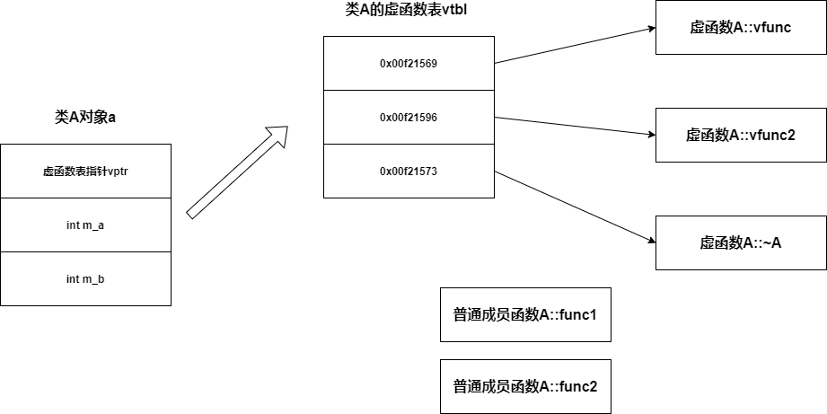

# 理解C++中的虚函数和多态

[学习来源-每日一课](https://time.geekbang.org/dailylesson/detail/100044017)

在C++中，实现多态的是通过虚函数、虚函数表来实现。

## 1. 虚函数引入对类的影响

对于一个新的类，引入虚函数会有什么变化？

先看代码：

```c++
class A
{
};

A a;
// 1 before add func1 and func2
cout << "sizeof(a) = " << sizeof(a) << endl;
```

在构建一个A的对象a，然后通过sizeof计算类对象的大小，得出的结果是1。

那么在类A中通过增加两个成员函数，再来看结果：

```c++
class A
{
public:
    void func1() {}
    void func2() {}
};

A a;
// 1 after add func1 and func2
cout << "sizeof(a) = " << sizeof(a) << endl;
```

说明引入了两个普通成员函数，对于类A的对象a，所占用的大小是没有变化。

再次引入一个虚函数myvirfunc：

```c++
class A
{
public:
    void func1() {}
    void func2() {}

    virtual void vfunc() {}
};

A a;
// 4 after add vfunc
cout << "sizeof(a) = " << sizeof(a) << endl;
```

引入了虚函数vfunc后，a对象的大小变为了4.这是因为引入虚函数后，编译器会给类中插入一个void *ptr的伪代码。正好占用4个字节，占用了类对象的内存。

## 2. 虚函数表引入的时机

在引入虚函数后编译期间，编译器会创建一个类的虚函数表，并且虚函数表会一直伴随这类的生命周期存在。

## 3. 虚函数表指针何时被赋值

有了虚函数的实现，编译器在编译期间，构造函数中会自动执行一个虚函数表指针的赋值操作，类似这样：

```c++
A() {
  vptr = &A::vftable;
}
```

## 4. 虚函数和内存布局

在类A中再次增加两个虚函数和两个成员变量，如下：

```c++
class A
{
public:
    virtual ~A() {}

    void func1() {}
    void func2() {}

    virtual void vfunc() {}
    virtual void vfunc2() {}

private:
    int m_a;
    int m_b;
};

A a;
// 12 when add virtual vfunc2, ~A, and member variables: m_a, m_b
cout << "sizeof(a) = " << sizeof(a) << endl;
```

得到的大小是12，因为虚函数指针占用4个字节，两个int型变量各占用4个字节。用图表示如下：



## 5. 多态在C++中的体现

使用C++的多态特性，简单来说就是父类有一个虚函数，子类也有一个同名的虚函数，当通过父类指针来new一个子类对象或者通过父类引用来绑定一个子类引用，用父类指针来调用虚函数其实执行的是子类的虚函数。代码示例如下：

```c++
class Base {
public:
    virtual void myvirfunc() {
        cout << "Base myvirfunc" << endl;
    }
};

class Derive : public Base {
public:
    virtual void myvirfunc() {
        cout << "Derive myvirfunc" << endl;
    }
};
```

针对以上类的定义，首先要确定的一点是只有使用了指针或者引用来调用了虚函数，才会是多态，比如：

```c++
Base* pa = new Base();
pa->myvirfunc();  // yes

Base base;
base.myvirfunc(); // no

Base* ybase = &base;
ybase->myvirfunc(); // yes
```

第二个是直接用类对象调用的虚函数而不是使用指针或者引用，那么就不是多态。再看下面的例子：

```c++
Derive derive;
Base* pbase = &derive;
pbase->myvirfunc();     // Derive::myvirfunc

Base* pbase2 = new Derive();
pbase2->myvirfunc();    // Derive::myvirfunc

Derive derive2;
Base& yinbase = derive2;
yinbase.myvirfunc();    // Derive::myvirfunc
```

上面的三种方式，可以看到都是使用指针或者引用来调用的虚函数，且指针或者引用对象实际上是Derive类，因此虚函数执行的也是Derive派生类的虚函数。

## 5. 总结

通过上面5点，可以针对C++的虚函数用法做一个简单的介绍。
