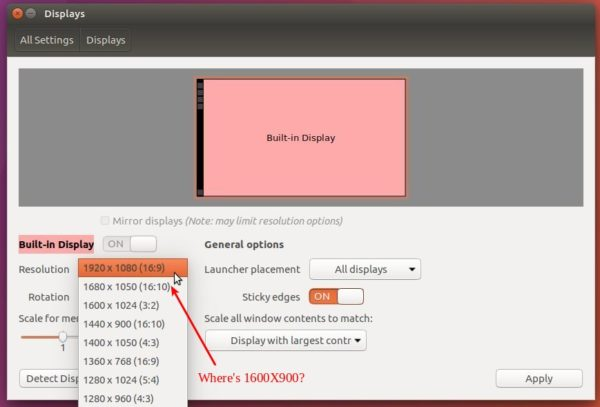
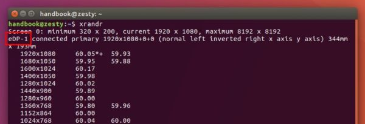
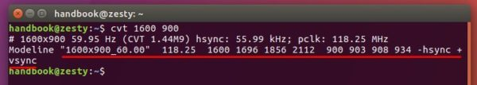
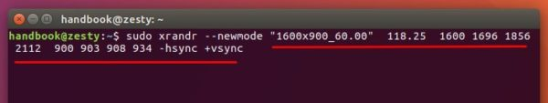
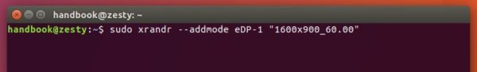
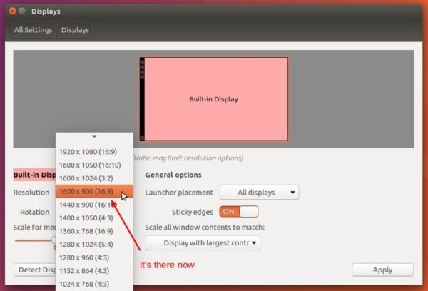
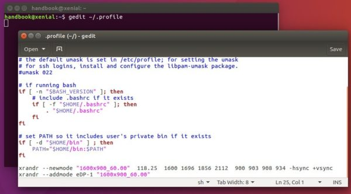

# 如何在ubuntu设置自定义分辨率

[How to Set A Custom Screen Resolution in Ubuntu Desktop](https://ubuntuhandbook.org/index.php/2017/04/custom-screen-resolution-ubuntu-desktop/)

你首选的屏幕分辨率在Display设置中没有找到？好的，这就准备给你展示下如何在ubuntu桌面版中增加自定义的分辨率。

在我的ubuntu17.04桌面版中，默认的1920x1080(19:9)分辨率对我来说有点高。尽管有一些选项可以缩放菜单、标题栏和文本，我还是更习惯于使用1600x900(16:9)的分辨率。



为了得到我期望的分辨率，我做了如下步骤：

## 1. 打开终端(Ctrl+Alt+T)，从dash中搜索Terminal，运行命令

```cmd
xrand
```

它输出了所有当前分辨率和所有可选的分辨率。我需要得到我的设备id，这里是ePD-1。



## 2. 运行命令计算VESA CVT模式中的分辨率

```cmd
cvt 1600 900
```

在命令行中替换1600 900(我这里是1600x900)来指定你的分辨率。



## 3. 拷贝模式行(红线标记的文字，看上图)，然后运行下面新模式

```cmd
sudo xrandr --newmode "1600x900_60.00"  118.25  1600 1696 1856 2112  900 903 908 934 -hsync +vsync
```

> 更新：对于ubuntu17.10，运行xhosts si:localuser:root命令避免sudo失败"No protocol specified Can’t open display 0:"

注意命令中的--newmode后是从前一个拷贝过来的输出指令。



## 4. 现在可以增加自己的分辨率设备了

```cmd
sudo xrandr --addmode eDP-1 "1600x900_60.00"
```

替换eDP-1和"1600x900_60.00"。



最后选择新增加的分辨率设置。



重要：为了让下次ubuntu启动记住本次的设置，需要编辑.profile配置文件，使用如下命令：

```cmd
gedit ~/.profile
```

将步骤3和4中的命令添加到最后两行中，然后保存文件。


