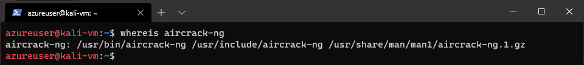

# 在Linux中查找东西

locate, whereis, which and find commands

[An intro to finding things in Linux](https://www.madebygps.com/an-intro-to-finding-things-in-linux/)


让我们看下面的命令：

```bash
locate
whereis
which
find
```

## locate命令

这个命令会遍历整个文件系统然后定位到每个出现的关键字，所以你可以想象这个结果是无法避免的。

```bash
locate keyword
```

locate会使用一个每天一更新的数据库，因此如果你搜索的东西是近期创建的，它可能会返回到你的搜索结果中。你可以这样使用

```bash
updatedb
```

来手动更新locate命令的数据库。

```bash
locate aircrack-ng
```


## whereis命令

在Linux中，可执行文件被称作二进制文件，如果你需要定位一个二进制，whereis命令比起locate更有效率。

```bash
whereis binary
```

这个命令会返回定位到的二进制文件，它的可用的源码和man page

```bash
whereis aircrack-ng
```



## which命令

Linux中的PATH变量保存了操作系统执行命令行程序的目录。

```bash
which binary
```

which命令定位PATH中的二进制文件。如果没有找到当前PATH的二进制文件，什么也不会返回。

```bash
which aircrack-ng
```


通常包含了/usr/bin目录，但有可能包含了/usr/sbin和一些其他的。

## find命令

更强大的搜索命令是find命令。你可以使用它来搜索任何指定的目录和其他一些参数。

基本的语法是：

```bash
find directory options expression
```

比方说我们有一个文件名是test.txt的文件，如果我想查找它但是不确定目录。我可以使用下面的命令从文件系统的根目录来查找

```bash
find / -type f -name test.txt
```

- /代表从文件系统根目录开始搜索
- -type指定了你搜索什么类型，f表示是文件，b表示指定的块驱动文件，c字符表示指定的驱动文件，d表示目录，l表示符号链接
- -name是你要搜索的文件名，结果将完全匹配


这个查找从根目录开始，逐个目录来搜索，可能需要一些时间。我们可以通过指定目录来提升速度，比如说我知道这个文件存在于home目录中。

```bash
time find /home -type f -name test.txt
```

这里使用了time命令可以看到每个命令执行了多久。


find命令显示了完全匹配的名字。如果file.txt有不同的后缀，结果将不会出现。我们创建另外一个文件test.conf然后使用find命令搜索test.txt，将不会得到test.conf文件。


我们可以通过通配符来解决这个限制。它有几种形式可以允许我们匹配多个字符：

比如我们有一个目录包含了文件cat,hat,what和bat

- *匹配了多个字符，*at将匹配:cat,hat,what和bat
- ?匹配了单个字符，?at将匹配cat,hat,bat但是没有what
- []匹配了方括弧中出现的字符, [c,b]将匹配cat和bat

```bash
find /home -type f -name test.*
```


find支持大量的测试和操作符，比如我们想查找所有的文件权限非0600且目录权限非0700的文件：

```bash
find ~ \( -type f -not -perm 0600 \) -or \( -type d -not perm 0700 \)
```

这个命令表示，查找所有文件权限非0600且目录非0700的文件。

- find ~表示在~目录(home)
- \( -type f -not -perm 0600) 反斜杠是转义括弧，这里使用括弧分组测试和操作符组成大的表达式。默认，find从左到右计算，-not告诉我们如果结果是false测试就会满足。-not也可以使用!代替所以可以使用\( -type f ! -perm 0600)
- -or告诉我们如果测试是true则会匹配。可以用-o来替代
- \( -type d -not perm 0700 \) 另外一个测试，和第一个非常像，指定了类型是目录。


find命令非常强大，确保更多的使用它。
